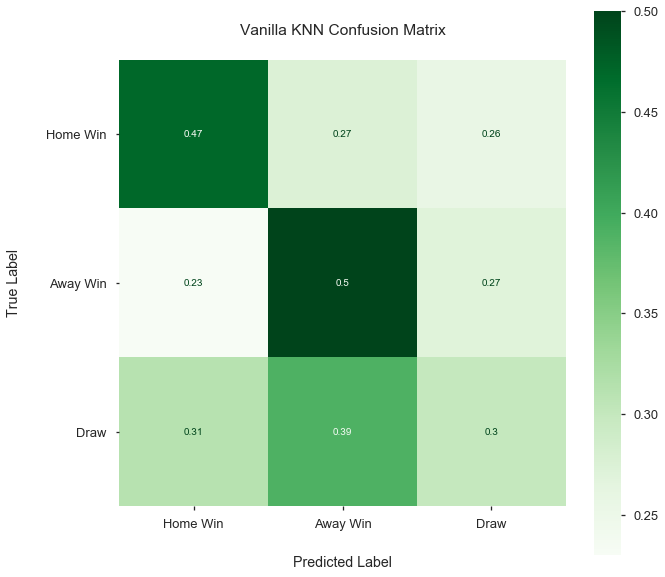

# Final Project Submission

Please fill out:
* Student name: Doug Steen
* Student pace: Full time
* Scheduled project review date/time: 2/8/2020, 11:30 AM CT
* Instructor name: James Irving, PhD
* Blog post URL: 


# Predicting Professional Soccer Match Outcomes Using Team Statistics and Machine Learning - Flatiron School Mod 5 Project


## Background
Soccer is among the world's most popular sports, with an estimated 3.5 billion followers in 2020 (https://sportsshow.net/most-followed-sports/). With such a high demand for the entertainment that soccer provides, revenues for the most successful soccer clubs and supporting industries are proportianately large. For example, Real Madrid (Spain) generated approximately € 750 million in revenue during the 2017-2018 season (https://www.statista.com/statistics/282735/revenue-of-the-spanish-football-club-real-madrid/).

Of course, the financial success of a soccer club is directly related to its team's performance and results on the pitch. In many professional soccer leagues in Europe and elsehwre, when a club performs well, they can be promoted to a more elite league (with better exposure and more revenue potential). Conversely, when one of these clubs performs poorly, they may be relegated to a lesser league (with less exposure and decreased revenue potential). Major soccer clubs are presently using every opportunity to gain a competitive edge - this includes leveraging data science and analytics to help achieve more favorable match outcomes.

### Purpose
This study aims to address the following questions using machine learning classification techniques:

1) Can match statistics (excluding knowledge of goals scored) be used to predict the outcome (Home Win, Away Win, or Draw) of a soccer match  with a reasonable degree of accuracy ?

2) Which match statistics (excluding knowledge of goals scored) are most important when attempting to predict the outcome (Home Win, Away Win, or Draw) of a soccer match ?

### Dataset
For this study, I use a dataset containing match statistics for 1,379 matches played in the English Premier League from August 2016 - January 2020. All data were obtained from https://www.api-football.com/. My process for obtaining data from API-Football is outlined in the ```python api-football_call.ipynb``` file in this directory. Please see the 'Obtain' and 'Scrub/Explore' sections of this notebook for more information on the dataset and its features.

### Machine Learning Algorithms
In this study, I explored the ability of the following machine learning algorithms to accurately predict match outcomes (Home Win, Away Win, Draw) based on match statistics (excluding knowledge of goals scored).

#### k-Nearest Neighbors (kNN)
kNN is a supervised algorithm that can be used for classification or regression problems. In classification, the algorithm predicts test class labels based on the distance to the nearest k training examples in n-dimensional feature space.

https://scikit-learn.org/stable/modules/generated/sklearn.neighbors.KNeighborsClassifier.html

#### Decision Trees
A Decision Tree is a supervised algorithm that can be used for classification or regression problems. In classification, a Decision Tree is constructed using the training data to incrementally partition examples using features that maximize information gain (with respect to training labels) at each step. Labels for test data are then predicted using the Decision Tree constructed from the training data.

https://scikit-learn.org/stable/modules/generated/sklearn.tree.DecisionTreeClassifier.html

#### Random Forest
A Random Forest is a Decision Tree-based supervised learning ensemble method. Random Forests can be used for classification or regression problems. A Random Forest includes many Decision Trees that each utilize (1) a bootstrap-sampled version of the original dataset and (2) random subsets of the dataset features. In classification problems, each of the Decision Trees in the Random Forest get a 'vote' towards the classification of each example in the test dataset. This method helps counteract the 'overfitting' that can take place when using a single Decision Tree.

https://scikit-learn.org/stable/modules/generated/sklearn.ensemble.RandomForestClassifier.html

#### AdaBoost
AdaBoost (short for 'Adaptive Boosting') is a Decision-Tree-based supervised learning ensemble method. AdaBoost can be used for classification or regression problems. An AdaBoost algorithm includes many Decision Trees that are 'weak learners' (i.e., each tree has a depth of 1). Unlike a Random Forest, the trees in AdaBoost are trained sequentially, so that examples that were misclassified in previous trees are more heavily weighted in subsequent trees. This method also helps counteract the 'overfitting' that can take place when using a single Decision Tree.

https://scikit-learn.org/stable/modules/generated/sklearn.ensemble.AdaBoostClassifier.html

#### XGBoost
XGBoost (short for eXtreme Gradient Boost) is an extension of the gradient boosting Decision-Tree-based ensemble method. In addition to gradient boosting, XGBoost allows for subsampling of the data at the row, column, and column per split levels, as well as incorporating L1 and L2 regularization. 

https://xgboost.readthedocs.io/en/latest/


## Import


```python
#!pip install -U fsds_100719
#!pip install imblearn
# !pip install shap
import warnings
from fsds_100719.imports import *
from tqdm import tqdm_notebook
import pandas_profiling as pp
from sklearn.preprocessing import StandardScaler
from sklearn.model_selection import train_test_split, GridSearchCV
from imblearn.over_sampling import SMOTE
from sklearn.neighbors import KNeighborsClassifier
from sklearn.tree import DecisionTreeClassifier
from sklearn.ensemble import RandomForestClassifier, AdaBoostClassifier
from xgboost import XGBClassifier
from sklearn.metrics import accuracy_score, classification_report, plot_confusion_matrix, roc_auc_score
from sklearn.tree import export_graphviz
from IPython.display import Image
from sklearn.tree import export_graphviz
from pydotplus import graph_from_dot_data
import shap
import plotly.express as px

# Display all columns of large dataframes
pd.set_option('display.max_columns', 0)

# Ignore warnings
warnings.filterwarnings('ignore')

# Set default plot style & inline plotting
plt.style.use('seaborn-talk')
%matplotlib inline
```

## Functions


```python
# Import functions for this project from functions.py file

from functions import multi_class_SMOTE, train_test_acc_auc
```

## Obtain


```python
# load dataset from directory (obtained in separate notebook using api-football calls)

df = pd.read_csv('premier_league.csv')
df.tail()
```


<div>
<style scoped>
    .dataframe tbody tr th:only-of-type {
        vertical-align: middle;
    }

    .dataframe tbody tr th {
        vertical-align: top;
    }

    .dataframe thead th {
        text-align: right;
    }
</style>
<table border="1" class="dataframe">
  <thead>
    <tr style="text-align: right;">
      <th></th>
      <th>team</th>
      <th>Ball Possession</th>
      <th>Blocked Shots</th>
      <th>Corner Kicks</th>
      <th>Fouls</th>
      <th>Goalkeeper Saves</th>
      <th>Offsides</th>
      <th>Passes %</th>
      <th>Passes accurate</th>
      <th>Red Cards</th>
      <th>Shots insidebox</th>
      <th>Shots off Goal</th>
      <th>Shots on Goal</th>
      <th>Shots outsidebox</th>
      <th>Total Shots</th>
      <th>Total passes</th>
      <th>Yellow Cards</th>
      <th>fixture_id</th>
      <th>league_id</th>
      <th>league</th>
      <th>event_date</th>
      <th>event_timestamp</th>
      <th>firstHalfStart</th>
      <th>secondHalfStart</th>
      <th>round</th>
      <th>status</th>
      <th>statusShort</th>
      <th>elapsed</th>
      <th>venue</th>
      <th>referee</th>
      <th>homeTeam</th>
      <th>awayTeam</th>
      <th>goalsHomeTeam</th>
      <th>goalsAwayTeam</th>
      <th>score</th>
    </tr>
  </thead>
  <tbody>
    <tr>
      <td>2753</td>
      <td>away</td>
      <td>50%</td>
      <td>3.0</td>
      <td>3</td>
      <td>7</td>
      <td>1.0</td>
      <td>0.0</td>
      <td>NaN</td>
      <td>371</td>
      <td>NaN</td>
      <td>7</td>
      <td>7</td>
      <td>2</td>
      <td>5</td>
      <td>12</td>
      <td>471</td>
      <td>1.0</td>
      <td>157253</td>
      <td>524</td>
      <td>{'name': 'Premier League', 'country': 'England...</td>
      <td>2020-01-22T19:30:00+00:00</td>
      <td>1579721400</td>
      <td>1.579721e+09</td>
      <td>1.579725e+09</td>
      <td>Regular Season - 24</td>
      <td>Match Finished</td>
      <td>FT</td>
      <td>90</td>
      <td>Tottenham Hotspur Stadium (London)</td>
      <td>Chris Kavanagh, England</td>
      <td>{'team_id': 47, 'team_name': 'Tottenham', 'log...</td>
      <td>{'team_id': 71, 'team_name': 'Norwich', 'logo'...</td>
      <td>2.0</td>
      <td>1.0</td>
      <td>{'halftime': '1-0', 'fulltime': '2-1', 'extrat...</td>
    </tr>
    <tr>
      <td>2754</td>
      <td>home</td>
      <td>72%</td>
      <td>7.0</td>
      <td>5</td>
      <td>11</td>
      <td>0.0</td>
      <td>2.0</td>
      <td>NaN</td>
      <td>590</td>
      <td>NaN</td>
      <td>10</td>
      <td>10</td>
      <td>6</td>
      <td>13</td>
      <td>23</td>
      <td>689</td>
      <td>0.0</td>
      <td>157251</td>
      <td>524</td>
      <td>{'name': 'Premier League', 'country': 'England...</td>
      <td>2020-01-22T20:15:00+00:00</td>
      <td>1579724100</td>
      <td>1.579724e+09</td>
      <td>1.579728e+09</td>
      <td>Regular Season - 24</td>
      <td>Match Finished</td>
      <td>FT</td>
      <td>90</td>
      <td>Old Trafford (Manchester)</td>
      <td>Jonathan Moss, England</td>
      <td>{'team_id': 33, 'team_name': 'Manchester Unite...</td>
      <td>{'team_id': 44, 'team_name': 'Burnley', 'logo'...</td>
      <td>0.0</td>
      <td>2.0</td>
      <td>{'halftime': '0-1', 'fulltime': '0-2', 'extrat...</td>
    </tr>
    <tr>
      <td>2755</td>
      <td>away</td>
      <td>28%</td>
      <td>1.0</td>
      <td>2</td>
      <td>7</td>
      <td>7.0</td>
      <td>2.0</td>
      <td>NaN</td>
      <td>154</td>
      <td>NaN</td>
      <td>4</td>
      <td>2</td>
      <td>2</td>
      <td>1</td>
      <td>5</td>
      <td>257</td>
      <td>2.0</td>
      <td>157251</td>
      <td>524</td>
      <td>{'name': 'Premier League', 'country': 'England...</td>
      <td>2020-01-22T20:15:00+00:00</td>
      <td>1579724100</td>
      <td>1.579724e+09</td>
      <td>1.579728e+09</td>
      <td>Regular Season - 24</td>
      <td>Match Finished</td>
      <td>FT</td>
      <td>90</td>
      <td>Old Trafford (Manchester)</td>
      <td>Jonathan Moss, England</td>
      <td>{'team_id': 33, 'team_name': 'Manchester Unite...</td>
      <td>{'team_id': 44, 'team_name': 'Burnley', 'logo'...</td>
      <td>0.0</td>
      <td>2.0</td>
      <td>{'halftime': '0-1', 'fulltime': '0-2', 'extrat...</td>
    </tr>
    <tr>
      <td>2756</td>
      <td>home</td>
      <td>46%</td>
      <td>2.0</td>
      <td>2</td>
      <td>6</td>
      <td>4.0</td>
      <td>2.0</td>
      <td>NaN</td>
      <td>412</td>
      <td>NaN</td>
      <td>8</td>
      <td>5</td>
      <td>3</td>
      <td>2</td>
      <td>10</td>
      <td>502</td>
      <td>0.0</td>
      <td>157250</td>
      <td>524</td>
      <td>{'name': 'Premier League', 'country': 'England...</td>
      <td>2020-01-23T20:00:00+00:00</td>
      <td>1579809600</td>
      <td>1.579810e+09</td>
      <td>1.579813e+09</td>
      <td>Regular Season - 24</td>
      <td>Match Finished</td>
      <td>FT</td>
      <td>90</td>
      <td>Molineux Stadium, Wolverhampton</td>
      <td>Michael Oliver, England</td>
      <td>{'team_id': 39, 'team_name': 'Wolves', 'logo':...</td>
      <td>{'team_id': 40, 'team_name': 'Liverpool', 'log...</td>
      <td>1.0</td>
      <td>2.0</td>
      <td>{'halftime': '0-1', 'fulltime': '1-2', 'extrat...</td>
    </tr>
    <tr>
      <td>2757</td>
      <td>away</td>
      <td>54%</td>
      <td>6.0</td>
      <td>4</td>
      <td>11</td>
      <td>2.0</td>
      <td>0.0</td>
      <td>NaN</td>
      <td>490</td>
      <td>NaN</td>
      <td>10</td>
      <td>1</td>
      <td>6</td>
      <td>3</td>
      <td>13</td>
      <td>585</td>
      <td>1.0</td>
      <td>157250</td>
      <td>524</td>
      <td>{'name': 'Premier League', 'country': 'England...</td>
      <td>2020-01-23T20:00:00+00:00</td>
      <td>1579809600</td>
      <td>1.579810e+09</td>
      <td>1.579813e+09</td>
      <td>Regular Season - 24</td>
      <td>Match Finished</td>
      <td>FT</td>
      <td>90</td>
      <td>Molineux Stadium, Wolverhampton</td>
      <td>Michael Oliver, England</td>
      <td>{'team_id': 39, 'team_name': 'Wolves', 'logo':...</td>
      <td>{'team_id': 40, 'team_name': 'Liverpool', 'log...</td>
      <td>1.0</td>
      <td>2.0</td>
      <td>{'halftime': '0-1', 'fulltime': '1-2', 'extrat...</td>
    </tr>
  </tbody>
</table>
</div>


## Scrub/Explore


```python
# Get an idea of datatypes in the dataframe
df.info()
```

    <class 'pandas.core.frame.DataFrame'>
    RangeIndex: 2758 entries, 0 to 2757
    Data columns (total 35 columns):
    team                2758 non-null object
    Ball Possession     2758 non-null object
    Blocked Shots       2756 non-null float64
    Corner Kicks        2758 non-null int64
    Fouls               2758 non-null int64
    Goalkeeper Saves    2746 non-null float64
    Offsides            2656 non-null float64
    Passes %            2280 non-null object
    Passes accurate     2758 non-null int64
    Red Cards           2161 non-null float64
    Shots insidebox     2758 non-null int64
    Shots off Goal      2758 non-null int64
    Shots on Goal       2758 non-null int64
    Shots outsidebox    2758 non-null int64
    Total Shots         2758 non-null int64
    Total passes        2758 non-null int64
    Yellow Cards        2598 non-null float64
    fixture_id          2758 non-null int64
    league_id           2758 non-null int64
    league              2758 non-null object
    event_date          2758 non-null object
    event_timestamp     2758 non-null int64
    firstHalfStart      2758 non-null float64
    secondHalfStart     2758 non-null float64
    round               2758 non-null object
    status              2758 non-null object
    statusShort         2758 non-null object
    elapsed             2758 non-null int64
    venue               2758 non-null object
    referee             1998 non-null object
    homeTeam            2758 non-null object
    awayTeam            2758 non-null object
    goalsHomeTeam       2758 non-null float64
    goalsAwayTeam       2758 non-null float64
    score               2758 non-null object
    dtypes: float64(9), int64(13), object(13)
    memory usage: 754.3+ KB
    


```python
# Designate columns that will not be important for the classification model
to_drop = ['league_id', 'league', 'event_date', 'event_timestamp', 'firstHalfStart', 'secondHalfStart',
           'round', 'status', 'statusShort', 'venue', 'referee', 'homeTeam', 'awayTeam', 'elapsed', 'score',
          'Shots off Goal', 'Shots on Goal']

df = df.drop(to_drop, axis=1)
df.head()
```


<div>
<style scoped>
    .dataframe tbody tr th:only-of-type {
        vertical-align: middle;
    }

    .dataframe tbody tr th {
        vertical-align: top;
    }

    .dataframe thead th {
        text-align: right;
    }
</style>
<table border="1" class="dataframe">
  <thead>
    <tr style="text-align: right;">
      <th></th>
      <th>team</th>
      <th>Ball Possession</th>
      <th>Blocked Shots</th>
      <th>Corner Kicks</th>
      <th>Fouls</th>
      <th>Goalkeeper Saves</th>
      <th>Offsides</th>
      <th>Passes %</th>
      <th>Passes accurate</th>
      <th>Red Cards</th>
      <th>Shots insidebox</th>
      <th>Shots outsidebox</th>
      <th>Total Shots</th>
      <th>Total passes</th>
      <th>Yellow Cards</th>
      <th>fixture_id</th>
      <th>goalsHomeTeam</th>
      <th>goalsAwayTeam</th>
    </tr>
  </thead>
  <tbody>
    <tr>
      <td>0</td>
      <td>home</td>
      <td>49%</td>
      <td>2.0</td>
      <td>5</td>
      <td>8</td>
      <td>4.0</td>
      <td>1.0</td>
      <td>76%</td>
      <td>343</td>
      <td>0.0</td>
      <td>7</td>
      <td>7</td>
      <td>14</td>
      <td>449</td>
      <td>2.0</td>
      <td>17696</td>
      <td>2.0</td>
      <td>1.0</td>
    </tr>
    <tr>
      <td>1</td>
      <td>away</td>
      <td>51%</td>
      <td>4.0</td>
      <td>3</td>
      <td>17</td>
      <td>3.0</td>
      <td>0.0</td>
      <td>78%</td>
      <td>352</td>
      <td>0.0</td>
      <td>9</td>
      <td>9</td>
      <td>18</td>
      <td>453</td>
      <td>2.0</td>
      <td>17696</td>
      <td>2.0</td>
      <td>1.0</td>
    </tr>
    <tr>
      <td>2</td>
      <td>home</td>
      <td>47%</td>
      <td>2.0</td>
      <td>7</td>
      <td>10</td>
      <td>7.0</td>
      <td>3.0</td>
      <td>71%</td>
      <td>249</td>
      <td>0.0</td>
      <td>6</td>
      <td>4</td>
      <td>10</td>
      <td>353</td>
      <td>3.0</td>
      <td>17691</td>
      <td>0.0</td>
      <td>1.0</td>
    </tr>
    <tr>
      <td>3</td>
      <td>away</td>
      <td>53%</td>
      <td>2.0</td>
      <td>4</td>
      <td>14</td>
      <td>3.0</td>
      <td>2.0</td>
      <td>78%</td>
      <td>297</td>
      <td>0.0</td>
      <td>11</td>
      <td>6</td>
      <td>17</td>
      <td>383</td>
      <td>2.0</td>
      <td>17691</td>
      <td>0.0</td>
      <td>1.0</td>
    </tr>
    <tr>
      <td>4</td>
      <td>home</td>
      <td>62%</td>
      <td>3.0</td>
      <td>3</td>
      <td>12</td>
      <td>2.0</td>
      <td>0.0</td>
      <td>72%</td>
      <td>298</td>
      <td>0.0</td>
      <td>7</td>
      <td>7</td>
      <td>14</td>
      <td>414</td>
      <td>2.0</td>
      <td>17692</td>
      <td>0.0</td>
      <td>1.0</td>
    </tr>
  </tbody>
</table>
</div>


```python
# Run pandas profiling for inital EDA

pp.ProfileReport(df)
```


    Tab(children=(HTML(value='<div id="overview-content" class="row variable spacing">\n    <div class="row">\n   …


Report generated with <a href="https://github.com/pandas-profiling/pandas-profiling">pandas-profiling</a>.


    


```python
# Missing values for Blocked Shots, Goalkeeper Saves, Offsides, Passes %, Red Cards, Yellow Cards

# Going to fill each (except Passes %) with median value for that column

fill_cols = ['Blocked_Shots', 'Goalkeeper_Saves',
             'Offsides', 'Red_Cards', 'Yellow_Cards']

for col in fill_cols:
    df[col].fillna(value=df[col].median(), inplace=True)

df.info()
```

    <class 'pandas.core.frame.DataFrame'>
    RangeIndex: 2758 entries, 0 to 2757
    Data columns (total 18 columns):
    team                2758 non-null object
    Ball_Possession     2758 non-null object
    Blocked_Shots       2758 non-null float64
    Corner_Kicks        2758 non-null int64
    Fouls               2758 non-null int64
    Goalkeeper_Saves    2758 non-null float64
    Offsides            2758 non-null float64
    Passes_%            2280 non-null object
    Passes_accurate     2758 non-null int64
    Red_Cards           2758 non-null float64
    Shots_insidebox     2758 non-null int64
    Shots_outsidebox    2758 non-null int64
    Total_Shots         2758 non-null int64
    Total_passes        2758 non-null int64
    Yellow_Cards        2758 non-null float64
    fixture_id          2758 non-null int64
    goalsHomeTeam       2758 non-null float64
    goalsAwayTeam       2758 non-null float64
    dtypes: float64(7), int64(8), object(3)
    memory usage: 388.0+ KB
    

### Re-cast object features


```python
# Convert team column to binary (0 = Home, 1 = Away)

for i in range(len(df)):
    if df['team'][i] == 'home':
        df['team'][i] = 0
    elif df['team'][i] == 'away':
        df['team'][i] = 1

df.team = df.team.astype('int64')
```


```python
# Strip % from Ball Possession and re-cast as a numerical variable

df['Ball_Possession'] = df['Ball_Possession'].str.rstrip('%').astype('int')
df['Ball_Possession']
```


    0       49
    1       51
    2       47
    3       53
    4       62
            ..
    2753    50
    2754    72
    2755    28
    2756    46
    2757    54
    Name: Ball_Possession, Length: 2758, dtype: int32


```python
# Re-calculate Passes (%) as Passes accurate / Total passes to handle missing values

df['Passes_%'] = df['Passes_accurate'] / df['Total_passes']
df['Passes_%']
```


    0       0.763920
    1       0.777042
    2       0.705382
    3       0.775457
    4       0.719807
              ...   
    2753    0.787686
    2754    0.856313
    2755    0.599222
    2756    0.820717
    2757    0.837607
    Name: Passes_%, Length: 2758, dtype: float64


### Collapse df to one row per match (instead of one row per team per match)


```python
df.info()
```

    <class 'pandas.core.frame.DataFrame'>
    RangeIndex: 2758 entries, 0 to 2757
    Data columns (total 18 columns):
    team                2758 non-null int64
    Ball_Possession     2758 non-null int32
    Blocked_Shots       2758 non-null float64
    Corner_Kicks        2758 non-null int64
    Fouls               2758 non-null int64
    Goalkeeper_Saves    2758 non-null float64
    Offsides            2758 non-null float64
    Passes_%            2758 non-null float64
    Passes_accurate     2758 non-null int64
    Red_Cards           2758 non-null float64
    Shots_insidebox     2758 non-null int64
    Shots_outsidebox    2758 non-null int64
    Total_Shots         2758 non-null int64
    Total_passes        2758 non-null int64
    Yellow_Cards        2758 non-null float64
    fixture_id          2758 non-null int64
    goalsHomeTeam       2758 non-null float64
    goalsAwayTeam       2758 non-null float64
    dtypes: float64(8), int32(1), int64(9)
    memory usage: 377.2 KB
    


```python
# Dataframe for only home team stats

df_home = df.loc[df.team == 0]
df_home.head()
```


<div>
<style scoped>
    .dataframe tbody tr th:only-of-type {
        vertical-align: middle;
    }

    .dataframe tbody tr th {
        vertical-align: top;
    }

    .dataframe thead th {
        text-align: right;
    }
</style>
<table border="1" class="dataframe">
  <thead>
    <tr style="text-align: right;">
      <th></th>
      <th>team</th>
      <th>Ball_Possession</th>
      <th>Blocked_Shots</th>
      <th>Corner_Kicks</th>
      <th>Fouls</th>
      <th>Goalkeeper_Saves</th>
      <th>Offsides</th>
      <th>Passes_%</th>
      <th>Passes_accurate</th>
      <th>Red_Cards</th>
      <th>Shots_insidebox</th>
      <th>Shots_outsidebox</th>
      <th>Total_Shots</th>
      <th>Total_passes</th>
      <th>Yellow_Cards</th>
      <th>fixture_id</th>
      <th>goalsHomeTeam</th>
      <th>goalsAwayTeam</th>
    </tr>
  </thead>
  <tbody>
    <tr>
      <td>0</td>
      <td>0</td>
      <td>49</td>
      <td>2.0</td>
      <td>5</td>
      <td>8</td>
      <td>4.0</td>
      <td>1.0</td>
      <td>0.763920</td>
      <td>343</td>
      <td>0.0</td>
      <td>7</td>
      <td>7</td>
      <td>14</td>
      <td>449</td>
      <td>2.0</td>
      <td>17696</td>
      <td>2.0</td>
      <td>1.0</td>
    </tr>
    <tr>
      <td>2</td>
      <td>0</td>
      <td>47</td>
      <td>2.0</td>
      <td>7</td>
      <td>10</td>
      <td>7.0</td>
      <td>3.0</td>
      <td>0.705382</td>
      <td>249</td>
      <td>0.0</td>
      <td>6</td>
      <td>4</td>
      <td>10</td>
      <td>353</td>
      <td>3.0</td>
      <td>17691</td>
      <td>0.0</td>
      <td>1.0</td>
    </tr>
    <tr>
      <td>4</td>
      <td>0</td>
      <td>62</td>
      <td>3.0</td>
      <td>3</td>
      <td>12</td>
      <td>2.0</td>
      <td>0.0</td>
      <td>0.719807</td>
      <td>298</td>
      <td>0.0</td>
      <td>7</td>
      <td>7</td>
      <td>14</td>
      <td>414</td>
      <td>2.0</td>
      <td>17692</td>
      <td>0.0</td>
      <td>1.0</td>
    </tr>
    <tr>
      <td>6</td>
      <td>0</td>
      <td>42</td>
      <td>2.0</td>
      <td>5</td>
      <td>10</td>
      <td>3.0</td>
      <td>5.0</td>
      <td>0.725762</td>
      <td>262</td>
      <td>0.0</td>
      <td>6</td>
      <td>6</td>
      <td>12</td>
      <td>361</td>
      <td>2.0</td>
      <td>17693</td>
      <td>1.0</td>
      <td>1.0</td>
    </tr>
    <tr>
      <td>8</td>
      <td>0</td>
      <td>45</td>
      <td>4.0</td>
      <td>9</td>
      <td>18</td>
      <td>0.0</td>
      <td>1.0</td>
      <td>0.750716</td>
      <td>262</td>
      <td>0.0</td>
      <td>8</td>
      <td>4</td>
      <td>12</td>
      <td>349</td>
      <td>3.0</td>
      <td>17694</td>
      <td>1.0</td>
      <td>1.0</td>
    </tr>
  </tbody>
</table>
</div>


```python
# Rename df_home columns before concatenation

for col in df_home.columns:
    df_home.rename(columns={col: f'{col}_H'}, inplace=True)

df_home.head()
```


<div>
<style scoped>
    .dataframe tbody tr th:only-of-type {
        vertical-align: middle;
    }

    .dataframe tbody tr th {
        vertical-align: top;
    }

    .dataframe thead th {
        text-align: right;
    }
</style>
<table border="1" class="dataframe">
  <thead>
    <tr style="text-align: right;">
      <th></th>
      <th>team_H</th>
      <th>Ball_Possession_H</th>
      <th>Blocked_Shots_H</th>
      <th>Corner_Kicks_H</th>
      <th>Fouls_H</th>
      <th>Goalkeeper_Saves_H</th>
      <th>Offsides_H</th>
      <th>Passes_%_H</th>
      <th>Passes_accurate_H</th>
      <th>Red_Cards_H</th>
      <th>Shots_insidebox_H</th>
      <th>Shots_outsidebox_H</th>
      <th>Total_Shots_H</th>
      <th>Total_passes_H</th>
      <th>Yellow_Cards_H</th>
      <th>fixture_id_H</th>
      <th>goalsHomeTeam_H</th>
      <th>goalsAwayTeam_H</th>
    </tr>
  </thead>
  <tbody>
    <tr>
      <td>0</td>
      <td>0</td>
      <td>49</td>
      <td>2.0</td>
      <td>5</td>
      <td>8</td>
      <td>4.0</td>
      <td>1.0</td>
      <td>0.763920</td>
      <td>343</td>
      <td>0.0</td>
      <td>7</td>
      <td>7</td>
      <td>14</td>
      <td>449</td>
      <td>2.0</td>
      <td>17696</td>
      <td>2.0</td>
      <td>1.0</td>
    </tr>
    <tr>
      <td>2</td>
      <td>0</td>
      <td>47</td>
      <td>2.0</td>
      <td>7</td>
      <td>10</td>
      <td>7.0</td>
      <td>3.0</td>
      <td>0.705382</td>
      <td>249</td>
      <td>0.0</td>
      <td>6</td>
      <td>4</td>
      <td>10</td>
      <td>353</td>
      <td>3.0</td>
      <td>17691</td>
      <td>0.0</td>
      <td>1.0</td>
    </tr>
    <tr>
      <td>4</td>
      <td>0</td>
      <td>62</td>
      <td>3.0</td>
      <td>3</td>
      <td>12</td>
      <td>2.0</td>
      <td>0.0</td>
      <td>0.719807</td>
      <td>298</td>
      <td>0.0</td>
      <td>7</td>
      <td>7</td>
      <td>14</td>
      <td>414</td>
      <td>2.0</td>
      <td>17692</td>
      <td>0.0</td>
      <td>1.0</td>
    </tr>
    <tr>
      <td>6</td>
      <td>0</td>
      <td>42</td>
      <td>2.0</td>
      <td>5</td>
      <td>10</td>
      <td>3.0</td>
      <td>5.0</td>
      <td>0.725762</td>
      <td>262</td>
      <td>0.0</td>
      <td>6</td>
      <td>6</td>
      <td>12</td>
      <td>361</td>
      <td>2.0</td>
      <td>17693</td>
      <td>1.0</td>
      <td>1.0</td>
    </tr>
    <tr>
      <td>8</td>
      <td>0</td>
      <td>45</td>
      <td>4.0</td>
      <td>9</td>
      <td>18</td>
      <td>0.0</td>
      <td>1.0</td>
      <td>0.750716</td>
      <td>262</td>
      <td>0.0</td>
      <td>8</td>
      <td>4</td>
      <td>12</td>
      <td>349</td>
      <td>3.0</td>
      <td>17694</td>
      <td>1.0</td>
      <td>1.0</td>
    </tr>
  </tbody>
</table>
</div>


```python
# Reset indes of df_home
df_home.set_index('fixture_id_H', inplace=True)
```


```python
# Dataframe for only away team stats

df_away = df[df.team == 1]
df_away.head()
```


<div>
<style scoped>
    .dataframe tbody tr th:only-of-type {
        vertical-align: middle;
    }

    .dataframe tbody tr th {
        vertical-align: top;
    }

    .dataframe thead th {
        text-align: right;
    }
</style>
<table border="1" class="dataframe">
  <thead>
    <tr style="text-align: right;">
      <th></th>
      <th>team</th>
      <th>Ball_Possession</th>
      <th>Blocked_Shots</th>
      <th>Corner_Kicks</th>
      <th>Fouls</th>
      <th>Goalkeeper_Saves</th>
      <th>Offsides</th>
      <th>Passes_%</th>
      <th>Passes_accurate</th>
      <th>Red_Cards</th>
      <th>Shots_insidebox</th>
      <th>Shots_outsidebox</th>
      <th>Total_Shots</th>
      <th>Total_passes</th>
      <th>Yellow_Cards</th>
      <th>fixture_id</th>
      <th>goalsHomeTeam</th>
      <th>goalsAwayTeam</th>
    </tr>
  </thead>
  <tbody>
    <tr>
      <td>1</td>
      <td>1</td>
      <td>51</td>
      <td>4.0</td>
      <td>3</td>
      <td>17</td>
      <td>3.0</td>
      <td>0.0</td>
      <td>0.777042</td>
      <td>352</td>
      <td>0.0</td>
      <td>9</td>
      <td>9</td>
      <td>18</td>
      <td>453</td>
      <td>2.0</td>
      <td>17696</td>
      <td>2.0</td>
      <td>1.0</td>
    </tr>
    <tr>
      <td>3</td>
      <td>1</td>
      <td>53</td>
      <td>2.0</td>
      <td>4</td>
      <td>14</td>
      <td>3.0</td>
      <td>2.0</td>
      <td>0.775457</td>
      <td>297</td>
      <td>0.0</td>
      <td>11</td>
      <td>6</td>
      <td>17</td>
      <td>383</td>
      <td>2.0</td>
      <td>17691</td>
      <td>0.0</td>
      <td>1.0</td>
    </tr>
    <tr>
      <td>5</td>
      <td>1</td>
      <td>38</td>
      <td>2.0</td>
      <td>6</td>
      <td>15</td>
      <td>4.0</td>
      <td>2.0</td>
      <td>0.583673</td>
      <td>143</td>
      <td>0.0</td>
      <td>8</td>
      <td>5</td>
      <td>13</td>
      <td>245</td>
      <td>2.0</td>
      <td>17692</td>
      <td>0.0</td>
      <td>1.0</td>
    </tr>
    <tr>
      <td>7</td>
      <td>1</td>
      <td>58</td>
      <td>5.0</td>
      <td>6</td>
      <td>14</td>
      <td>5.0</td>
      <td>0.0</td>
      <td>0.795031</td>
      <td>384</td>
      <td>0.0</td>
      <td>8</td>
      <td>5</td>
      <td>13</td>
      <td>483</td>
      <td>2.0</td>
      <td>17693</td>
      <td>1.0</td>
      <td>1.0</td>
    </tr>
    <tr>
      <td>9</td>
      <td>1</td>
      <td>55</td>
      <td>2.0</td>
      <td>6</td>
      <td>14</td>
      <td>1.0</td>
      <td>2.0</td>
      <td>0.785714</td>
      <td>330</td>
      <td>0.0</td>
      <td>7</td>
      <td>5</td>
      <td>12</td>
      <td>420</td>
      <td>5.0</td>
      <td>17694</td>
      <td>1.0</td>
      <td>1.0</td>
    </tr>
  </tbody>
</table>
</div>


```python
# Rename df_away columns before concatenation

for col in df_away.columns:
    df_away.rename(columns={col: f'{col}_A'}, inplace=True)

df_away.head()
```


<div>
<style scoped>
    .dataframe tbody tr th:only-of-type {
        vertical-align: middle;
    }

    .dataframe tbody tr th {
        vertical-align: top;
    }

    .dataframe thead th {
        text-align: right;
    }
</style>
<table border="1" class="dataframe">
  <thead>
    <tr style="text-align: right;">
      <th></th>
      <th>team_A</th>
      <th>Ball_Possession_A</th>
      <th>Blocked_Shots_A</th>
      <th>Corner_Kicks_A</th>
      <th>Fouls_A</th>
      <th>Goalkeeper_Saves_A</th>
      <th>Offsides_A</th>
      <th>Passes_%_A</th>
      <th>Passes_accurate_A</th>
      <th>Red_Cards_A</th>
      <th>Shots_insidebox_A</th>
      <th>Shots_outsidebox_A</th>
      <th>Total_Shots_A</th>
      <th>Total_passes_A</th>
      <th>Yellow_Cards_A</th>
      <th>fixture_id_A</th>
      <th>goalsHomeTeam_A</th>
      <th>goalsAwayTeam_A</th>
    </tr>
  </thead>
  <tbody>
    <tr>
      <td>1</td>
      <td>1</td>
      <td>51</td>
      <td>4.0</td>
      <td>3</td>
      <td>17</td>
      <td>3.0</td>
      <td>0.0</td>
      <td>0.777042</td>
      <td>352</td>
      <td>0.0</td>
      <td>9</td>
      <td>9</td>
      <td>18</td>
      <td>453</td>
      <td>2.0</td>
      <td>17696</td>
      <td>2.0</td>
      <td>1.0</td>
    </tr>
    <tr>
      <td>3</td>
      <td>1</td>
      <td>53</td>
      <td>2.0</td>
      <td>4</td>
      <td>14</td>
      <td>3.0</td>
      <td>2.0</td>
      <td>0.775457</td>
      <td>297</td>
      <td>0.0</td>
      <td>11</td>
      <td>6</td>
      <td>17</td>
      <td>383</td>
      <td>2.0</td>
      <td>17691</td>
      <td>0.0</td>
      <td>1.0</td>
    </tr>
    <tr>
      <td>5</td>
      <td>1</td>
      <td>38</td>
      <td>2.0</td>
      <td>6</td>
      <td>15</td>
      <td>4.0</td>
      <td>2.0</td>
      <td>0.583673</td>
      <td>143</td>
      <td>0.0</td>
      <td>8</td>
      <td>5</td>
      <td>13</td>
      <td>245</td>
      <td>2.0</td>
      <td>17692</td>
      <td>0.0</td>
      <td>1.0</td>
    </tr>
    <tr>
      <td>7</td>
      <td>1</td>
      <td>58</td>
      <td>5.0</td>
      <td>6</td>
      <td>14</td>
      <td>5.0</td>
      <td>0.0</td>
      <td>0.795031</td>
      <td>384</td>
      <td>0.0</td>
      <td>8</td>
      <td>5</td>
      <td>13</td>
      <td>483</td>
      <td>2.0</td>
      <td>17693</td>
      <td>1.0</td>
      <td>1.0</td>
    </tr>
    <tr>
      <td>9</td>
      <td>1</td>
      <td>55</td>
      <td>2.0</td>
      <td>6</td>
      <td>14</td>
      <td>1.0</td>
      <td>2.0</td>
      <td>0.785714</td>
      <td>330</td>
      <td>0.0</td>
      <td>7</td>
      <td>5</td>
      <td>12</td>
      <td>420</td>
      <td>5.0</td>
      <td>17694</td>
      <td>1.0</td>
      <td>1.0</td>
    </tr>
  </tbody>
</table>
</div>


```python
# Reset index of df_away
df_away.set_index('fixture_id_A', inplace=True)
```


```python
# Concatenate df_home and df_away dataframes

df_final = pd.concat([df_home, df_away], axis=1)
df_final.head()
```


<div>
<style scoped>
    .dataframe tbody tr th:only-of-type {
        vertical-align: middle;
    }

    .dataframe tbody tr th {
        vertical-align: top;
    }

    .dataframe thead th {
        text-align: right;
    }
</style>
<table border="1" class="dataframe">
  <thead>
    <tr style="text-align: right;">
      <th></th>
      <th>team_H</th>
      <th>Ball_Possession_H</th>
      <th>Blocked_Shots_H</th>
      <th>Corner_Kicks_H</th>
      <th>Fouls_H</th>
      <th>Goalkeeper_Saves_H</th>
      <th>Offsides_H</th>
      <th>Passes_%_H</th>
      <th>Passes_accurate_H</th>
      <th>Red_Cards_H</th>
      <th>Shots_insidebox_H</th>
      <th>Shots_outsidebox_H</th>
      <th>Total_Shots_H</th>
      <th>Total_passes_H</th>
      <th>Yellow_Cards_H</th>
      <th>goalsHomeTeam_H</th>
      <th>goalsAwayTeam_H</th>
      <th>team_A</th>
      <th>Ball_Possession_A</th>
      <th>Blocked_Shots_A</th>
      <th>Corner_Kicks_A</th>
      <th>Fouls_A</th>
      <th>Goalkeeper_Saves_A</th>
      <th>Offsides_A</th>
      <th>Passes_%_A</th>
      <th>Passes_accurate_A</th>
      <th>Red_Cards_A</th>
      <th>Shots_insidebox_A</th>
      <th>Shots_outsidebox_A</th>
      <th>Total_Shots_A</th>
      <th>Total_passes_A</th>
      <th>Yellow_Cards_A</th>
      <th>goalsHomeTeam_A</th>
      <th>goalsAwayTeam_A</th>
    </tr>
  </thead>
  <tbody>
    <tr>
      <td>17696</td>
      <td>0</td>
      <td>49</td>
      <td>2.0</td>
      <td>5</td>
      <td>8</td>
      <td>4.0</td>
      <td>1.0</td>
      <td>0.763920</td>
      <td>343</td>
      <td>0.0</td>
      <td>7</td>
      <td>7</td>
      <td>14</td>
      <td>449</td>
      <td>2.0</td>
      <td>2.0</td>
      <td>1.0</td>
      <td>1</td>
      <td>51</td>
      <td>4.0</td>
      <td>3</td>
      <td>17</td>
      <td>3.0</td>
      <td>0.0</td>
      <td>0.777042</td>
      <td>352</td>
      <td>0.0</td>
      <td>9</td>
      <td>9</td>
      <td>18</td>
      <td>453</td>
      <td>2.0</td>
      <td>2.0</td>
      <td>1.0</td>
    </tr>
    <tr>
      <td>17691</td>
      <td>0</td>
      <td>47</td>
      <td>2.0</td>
      <td>7</td>
      <td>10</td>
      <td>7.0</td>
      <td>3.0</td>
      <td>0.705382</td>
      <td>249</td>
      <td>0.0</td>
      <td>6</td>
      <td>4</td>
      <td>10</td>
      <td>353</td>
      <td>3.0</td>
      <td>0.0</td>
      <td>1.0</td>
      <td>1</td>
      <td>53</td>
      <td>2.0</td>
      <td>4</td>
      <td>14</td>
      <td>3.0</td>
      <td>2.0</td>
      <td>0.775457</td>
      <td>297</td>
      <td>0.0</td>
      <td>11</td>
      <td>6</td>
      <td>17</td>
      <td>383</td>
      <td>2.0</td>
      <td>0.0</td>
      <td>1.0</td>
    </tr>
    <tr>
      <td>17692</td>
      <td>0</td>
      <td>62</td>
      <td>3.0</td>
      <td>3</td>
      <td>12</td>
      <td>2.0</td>
      <td>0.0</td>
      <td>0.719807</td>
      <td>298</td>
      <td>0.0</td>
      <td>7</td>
      <td>7</td>
      <td>14</td>
      <td>414</td>
      <td>2.0</td>
      <td>0.0</td>
      <td>1.0</td>
      <td>1</td>
      <td>38</td>
      <td>2.0</td>
      <td>6</td>
      <td>15</td>
      <td>4.0</td>
      <td>2.0</td>
      <td>0.583673</td>
      <td>143</td>
      <td>0.0</td>
      <td>8</td>
      <td>5</td>
      <td>13</td>
      <td>245</td>
      <td>2.0</td>
      <td>0.0</td>
      <td>1.0</td>
    </tr>
    <tr>
      <td>17693</td>
      <td>0</td>
      <td>42</td>
      <td>2.0</td>
      <td>5</td>
      <td>10</td>
      <td>3.0</td>
      <td>5.0</td>
      <td>0.725762</td>
      <td>262</td>
      <td>0.0</td>
      <td>6</td>
      <td>6</td>
      <td>12</td>
      <td>361</td>
      <td>2.0</td>
      <td>1.0</td>
      <td>1.0</td>
      <td>1</td>
      <td>58</td>
      <td>5.0</td>
      <td>6</td>
      <td>14</td>
      <td>5.0</td>
      <td>0.0</td>
      <td>0.795031</td>
      <td>384</td>
      <td>0.0</td>
      <td>8</td>
      <td>5</td>
      <td>13</td>
      <td>483</td>
      <td>2.0</td>
      <td>1.0</td>
      <td>1.0</td>
    </tr>
    <tr>
      <td>17694</td>
      <td>0</td>
      <td>45</td>
      <td>4.0</td>
      <td>9</td>
      <td>18</td>
      <td>0.0</td>
      <td>1.0</td>
      <td>0.750716</td>
      <td>262</td>
      <td>0.0</td>
      <td>8</td>
      <td>4</td>
      <td>12</td>
      <td>349</td>
      <td>3.0</td>
      <td>1.0</td>
      <td>1.0</td>
      <td>1</td>
      <td>55</td>
      <td>2.0</td>
      <td>6</td>
      <td>14</td>
      <td>1.0</td>
      <td>2.0</td>
      <td>0.785714</td>
      <td>330</td>
      <td>0.0</td>
      <td>7</td>
      <td>5</td>
      <td>12</td>
      <td>420</td>
      <td>5.0</td>
      <td>1.0</td>
      <td>1.0</td>
    </tr>
  </tbody>
</table>
</div>


### Create target variable (class labels)

0 = Home Team Win, 1 = Away Team Win, 2 = Draw


```python
# Create target variable column: 0 = Win, 1 = Loss, 2 = Draw

target = []
for i in range(len(df_final)):
    if df_final['goalsHomeTeam_H'].iloc[i] > df_final['goalsAwayTeam_H'].iloc[i]:
        target.append(0)  # Home team win
    elif df_final['goalsHomeTeam_H'].iloc[i] < df_final['goalsAwayTeam_H'].iloc[i]:
        target.append(1)  # Away team win
    elif df_final['goalsHomeTeam_H'].iloc[i] == df_final['goalsAwayTeam_H'].iloc[i]:
        target.append(2)  # Draw
```


```python
df_final['target'] = target
```


```python
df_final.head()
```


<div>
<style scoped>
    .dataframe tbody tr th:only-of-type {
        vertical-align: middle;
    }

    .dataframe tbody tr th {
        vertical-align: top;
    }

    .dataframe thead th {
        text-align: right;
    }
</style>
<table border="1" class="dataframe">
  <thead>
    <tr style="text-align: right;">
      <th></th>
      <th>team_H</th>
      <th>Ball_Possession_H</th>
      <th>Blocked_Shots_H</th>
      <th>Corner_Kicks_H</th>
      <th>Fouls_H</th>
      <th>Goalkeeper_Saves_H</th>
      <th>Offsides_H</th>
      <th>Passes_%_H</th>
      <th>Passes_accurate_H</th>
      <th>Red_Cards_H</th>
      <th>Shots_insidebox_H</th>
      <th>Shots_outsidebox_H</th>
      <th>Total_Shots_H</th>
      <th>Total_passes_H</th>
      <th>Yellow_Cards_H</th>
      <th>goalsHomeTeam_H</th>
      <th>goalsAwayTeam_H</th>
      <th>team_A</th>
      <th>Ball_Possession_A</th>
      <th>Blocked_Shots_A</th>
      <th>Corner_Kicks_A</th>
      <th>Fouls_A</th>
      <th>Goalkeeper_Saves_A</th>
      <th>Offsides_A</th>
      <th>Passes_%_A</th>
      <th>Passes_accurate_A</th>
      <th>Red_Cards_A</th>
      <th>Shots_insidebox_A</th>
      <th>Shots_outsidebox_A</th>
      <th>Total_Shots_A</th>
      <th>Total_passes_A</th>
      <th>Yellow_Cards_A</th>
      <th>goalsHomeTeam_A</th>
      <th>goalsAwayTeam_A</th>
      <th>target</th>
    </tr>
  </thead>
  <tbody>
    <tr>
      <td>17696</td>
      <td>0</td>
      <td>49</td>
      <td>2.0</td>
      <td>5</td>
      <td>8</td>
      <td>4.0</td>
      <td>1.0</td>
      <td>0.763920</td>
      <td>343</td>
      <td>0.0</td>
      <td>7</td>
      <td>7</td>
      <td>14</td>
      <td>449</td>
      <td>2.0</td>
      <td>2.0</td>
      <td>1.0</td>
      <td>1</td>
      <td>51</td>
      <td>4.0</td>
      <td>3</td>
      <td>17</td>
      <td>3.0</td>
      <td>0.0</td>
      <td>0.777042</td>
      <td>352</td>
      <td>0.0</td>
      <td>9</td>
      <td>9</td>
      <td>18</td>
      <td>453</td>
      <td>2.0</td>
      <td>2.0</td>
      <td>1.0</td>
      <td>0</td>
    </tr>
    <tr>
      <td>17691</td>
      <td>0</td>
      <td>47</td>
      <td>2.0</td>
      <td>7</td>
      <td>10</td>
      <td>7.0</td>
      <td>3.0</td>
      <td>0.705382</td>
      <td>249</td>
      <td>0.0</td>
      <td>6</td>
      <td>4</td>
      <td>10</td>
      <td>353</td>
      <td>3.0</td>
      <td>0.0</td>
      <td>1.0</td>
      <td>1</td>
      <td>53</td>
      <td>2.0</td>
      <td>4</td>
      <td>14</td>
      <td>3.0</td>
      <td>2.0</td>
      <td>0.775457</td>
      <td>297</td>
      <td>0.0</td>
      <td>11</td>
      <td>6</td>
      <td>17</td>
      <td>383</td>
      <td>2.0</td>
      <td>0.0</td>
      <td>1.0</td>
      <td>1</td>
    </tr>
    <tr>
      <td>17692</td>
      <td>0</td>
      <td>62</td>
      <td>3.0</td>
      <td>3</td>
      <td>12</td>
      <td>2.0</td>
      <td>0.0</td>
      <td>0.719807</td>
      <td>298</td>
      <td>0.0</td>
      <td>7</td>
      <td>7</td>
      <td>14</td>
      <td>414</td>
      <td>2.0</td>
      <td>0.0</td>
      <td>1.0</td>
      <td>1</td>
      <td>38</td>
      <td>2.0</td>
      <td>6</td>
      <td>15</td>
      <td>4.0</td>
      <td>2.0</td>
      <td>0.583673</td>
      <td>143</td>
      <td>0.0</td>
      <td>8</td>
      <td>5</td>
      <td>13</td>
      <td>245</td>
      <td>2.0</td>
      <td>0.0</td>
      <td>1.0</td>
      <td>1</td>
    </tr>
    <tr>
      <td>17693</td>
      <td>0</td>
      <td>42</td>
      <td>2.0</td>
      <td>5</td>
      <td>10</td>
      <td>3.0</td>
      <td>5.0</td>
      <td>0.725762</td>
      <td>262</td>
      <td>0.0</td>
      <td>6</td>
      <td>6</td>
      <td>12</td>
      <td>361</td>
      <td>2.0</td>
      <td>1.0</td>
      <td>1.0</td>
      <td>1</td>
      <td>58</td>
      <td>5.0</td>
      <td>6</td>
      <td>14</td>
      <td>5.0</td>
      <td>0.0</td>
      <td>0.795031</td>
      <td>384</td>
      <td>0.0</td>
      <td>8</td>
      <td>5</td>
      <td>13</td>
      <td>483</td>
      <td>2.0</td>
      <td>1.0</td>
      <td>1.0</td>
      <td>2</td>
    </tr>
    <tr>
      <td>17694</td>
      <td>0</td>
      <td>45</td>
      <td>4.0</td>
      <td>9</td>
      <td>18</td>
      <td>0.0</td>
      <td>1.0</td>
      <td>0.750716</td>
      <td>262</td>
      <td>0.0</td>
      <td>8</td>
      <td>4</td>
      <td>12</td>
      <td>349</td>
      <td>3.0</td>
      <td>1.0</td>
      <td>1.0</td>
      <td>1</td>
      <td>55</td>
      <td>2.0</td>
      <td>6</td>
      <td>14</td>
      <td>1.0</td>
      <td>2.0</td>
      <td>0.785714</td>
      <td>330</td>
      <td>0.0</td>
      <td>7</td>
      <td>5</td>
      <td>12</td>
      <td>420</td>
      <td>5.0</td>
      <td>1.0</td>
      <td>1.0</td>
      <td>2</td>
    </tr>
  </tbody>
</table>
</div>


```python
# Feature engineer new column: Ball_Pos_Diff as Ball_Possession_H - Ball_Possession_A
# These two columns are going to be perfectly negatively correlated, so makes sense to collapse them

df_final['Ball_Pos_Diff'] = df_final['Ball_Possession_H'] - \
    df_final['Ball_Possession_A']
df_final.drop(['Ball_Possession_H', 'Ball_Possession_A'], axis=1, inplace=True)
```


```python
# Final drop of unnecessary columns from df_diff (fixture_id remaining as index)

df_final.drop(['team_H', 'goalsHomeTeam_H', 'goalsAwayTeam_H',
               'team_A', 'goalsHomeTeam_A', 'goalsAwayTeam_A'], axis=1, inplace=True)
```


```python
df_final.head()
```


<div>
<style scoped>
    .dataframe tbody tr th:only-of-type {
        vertical-align: middle;
    }

    .dataframe tbody tr th {
        vertical-align: top;
    }

    .dataframe thead th {
        text-align: right;
    }
</style>
<table border="1" class="dataframe">
  <thead>
    <tr style="text-align: right;">
      <th></th>
      <th>Blocked_Shots_H</th>
      <th>Corner_Kicks_H</th>
      <th>Fouls_H</th>
      <th>Goalkeeper_Saves_H</th>
      <th>Offsides_H</th>
      <th>Passes_%_H</th>
      <th>Passes_accurate_H</th>
      <th>Red_Cards_H</th>
      <th>Shots_insidebox_H</th>
      <th>Shots_outsidebox_H</th>
      <th>Total_Shots_H</th>
      <th>Total_passes_H</th>
      <th>Yellow_Cards_H</th>
      <th>Blocked_Shots_A</th>
      <th>Corner_Kicks_A</th>
      <th>Fouls_A</th>
      <th>Goalkeeper_Saves_A</th>
      <th>Offsides_A</th>
      <th>Passes_%_A</th>
      <th>Passes_accurate_A</th>
      <th>Red_Cards_A</th>
      <th>Shots_insidebox_A</th>
      <th>Shots_outsidebox_A</th>
      <th>Total_Shots_A</th>
      <th>Total_passes_A</th>
      <th>Yellow_Cards_A</th>
      <th>target</th>
      <th>Ball_Pos_Diff</th>
    </tr>
  </thead>
  <tbody>
    <tr>
      <td>17696</td>
      <td>2.0</td>
      <td>5</td>
      <td>8</td>
      <td>4.0</td>
      <td>1.0</td>
      <td>0.763920</td>
      <td>343</td>
      <td>0.0</td>
      <td>7</td>
      <td>7</td>
      <td>14</td>
      <td>449</td>
      <td>2.0</td>
      <td>4.0</td>
      <td>3</td>
      <td>17</td>
      <td>3.0</td>
      <td>0.0</td>
      <td>0.777042</td>
      <td>352</td>
      <td>0.0</td>
      <td>9</td>
      <td>9</td>
      <td>18</td>
      <td>453</td>
      <td>2.0</td>
      <td>0</td>
      <td>-2</td>
    </tr>
    <tr>
      <td>17691</td>
      <td>2.0</td>
      <td>7</td>
      <td>10</td>
      <td>7.0</td>
      <td>3.0</td>
      <td>0.705382</td>
      <td>249</td>
      <td>0.0</td>
      <td>6</td>
      <td>4</td>
      <td>10</td>
      <td>353</td>
      <td>3.0</td>
      <td>2.0</td>
      <td>4</td>
      <td>14</td>
      <td>3.0</td>
      <td>2.0</td>
      <td>0.775457</td>
      <td>297</td>
      <td>0.0</td>
      <td>11</td>
      <td>6</td>
      <td>17</td>
      <td>383</td>
      <td>2.0</td>
      <td>1</td>
      <td>-6</td>
    </tr>
    <tr>
      <td>17692</td>
      <td>3.0</td>
      <td>3</td>
      <td>12</td>
      <td>2.0</td>
      <td>0.0</td>
      <td>0.719807</td>
      <td>298</td>
      <td>0.0</td>
      <td>7</td>
      <td>7</td>
      <td>14</td>
      <td>414</td>
      <td>2.0</td>
      <td>2.0</td>
      <td>6</td>
      <td>15</td>
      <td>4.0</td>
      <td>2.0</td>
      <td>0.583673</td>
      <td>143</td>
      <td>0.0</td>
      <td>8</td>
      <td>5</td>
      <td>13</td>
      <td>245</td>
      <td>2.0</td>
      <td>1</td>
      <td>24</td>
    </tr>
    <tr>
      <td>17693</td>
      <td>2.0</td>
      <td>5</td>
      <td>10</td>
      <td>3.0</td>
      <td>5.0</td>
      <td>0.725762</td>
      <td>262</td>
      <td>0.0</td>
      <td>6</td>
      <td>6</td>
      <td>12</td>
      <td>361</td>
      <td>2.0</td>
      <td>5.0</td>
      <td>6</td>
      <td>14</td>
      <td>5.0</td>
      <td>0.0</td>
      <td>0.795031</td>
      <td>384</td>
      <td>0.0</td>
      <td>8</td>
      <td>5</td>
      <td>13</td>
      <td>483</td>
      <td>2.0</td>
      <td>2</td>
      <td>-16</td>
    </tr>
    <tr>
      <td>17694</td>
      <td>4.0</td>
      <td>9</td>
      <td>18</td>
      <td>0.0</td>
      <td>1.0</td>
      <td>0.750716</td>
      <td>262</td>
      <td>0.0</td>
      <td>8</td>
      <td>4</td>
      <td>12</td>
      <td>349</td>
      <td>3.0</td>
      <td>2.0</td>
      <td>6</td>
      <td>14</td>
      <td>1.0</td>
      <td>2.0</td>
      <td>0.785714</td>
      <td>330</td>
      <td>0.0</td>
      <td>7</td>
      <td>5</td>
      <td>12</td>
      <td>420</td>
      <td>5.0</td>
      <td>2</td>
      <td>-10</td>
    </tr>
  </tbody>
</table>
</div>


```python
# Check class imbalance of dataset

df_final.target.value_counts(normalize=True)
```


    0    0.467730
    1    0.305294
    2    0.226976
    Name: target, dtype: float64


```python
# Create labels dictionary for future use

labels = {'Home Win': 0, 'Away Win': 1, 'Draw': 2}
```


```python
# Visualize pandas profiling again

pp.ProfileReport(df_final)
```


    Tab(children=(HTML(value='<div id="overview-content" class="row variable spacing">\n    <div class="row">\n   …


Report generated with <a href="https://github.com/pandas-profiling/pandas-profiling">pandas-profiling</a>.


    


```python
df_final.info()
```

    <class 'pandas.core.frame.DataFrame'>
    Int64Index: 1379 entries, 17696 to 157250
    Data columns (total 28 columns):
    Blocked_Shots_H       1379 non-null float64
    Corner_Kicks_H        1379 non-null int64
    Fouls_H               1379 non-null int64
    Goalkeeper_Saves_H    1379 non-null float64
    Offsides_H            1379 non-null float64
    Passes_%_H            1379 non-null float64
    Passes_accurate_H     1379 non-null int64
    Red_Cards_H           1379 non-null float64
    Shots_insidebox_H     1379 non-null int64
    Shots_outsidebox_H    1379 non-null int64
    Total_Shots_H         1379 non-null int64
    Total_passes_H        1379 non-null int64
    Yellow_Cards_H        1379 non-null float64
    Blocked_Shots_A       1379 non-null float64
    Corner_Kicks_A        1379 non-null int64
    Fouls_A               1379 non-null int64
    Goalkeeper_Saves_A    1379 non-null float64
    Offsides_A            1379 non-null float64
    Passes_%_A            1379 non-null float64
    Passes_accurate_A     1379 non-null int64
    Red_Cards_A           1379 non-null float64
    Shots_insidebox_A     1379 non-null int64
    Shots_outsidebox_A    1379 non-null int64
    Total_Shots_A         1379 non-null int64
    Total_passes_A        1379 non-null int64
    Yellow_Cards_A        1379 non-null float64
    target                1379 non-null int64
    Ball_Pos_Diff         1379 non-null int32
    dtypes: float64(12), int32(1), int64(15)
    memory usage: 307.0 KB
    

## Models & Interpretations

### Model 1a: Vanilla K Nearest Neighbors (KNN) Classifier


```python
# Separate features and target labels

X = df_final.drop('target', axis=1)
y = df_final['target']
```


```python
# Perform a train_test split on the data

X_train, X_test, y_train, y_test = train_test_split(
    X, y, random_state=42, test_size=0.25)
```


```python
# Scale X data before passing to KNN algorithm

scaler = StandardScaler()
X_train = scaler.fit_transform(X_train)
X_test = scaler.transform(X_test)

X_train.shape, y_train.shape
```


    ((1034, 27), (1034,))


```python
# Perform Synthetic Minority Over-Sampling Technique (SMOTE) to achieve class balance

X_train, y_train = multi_class_SMOTE(
    X_train, y_train, n=3, random_state=42, verbose=2)
```

    Label counts for Original y:
    0    477
    1    321
    2    236
    Name: target, dtype: int64
    

    The target type should be binary.
    

    Label counts after SMOTE # 1:
    2    477
    0    477
    1    321
    dtype: int64
    

    The target type should be binary.
    

    Label counts after SMOTE # 2:
    2    477
    1    477
    0    477
    dtype: int64
    


```python
# Fit a vanilla KNN classifier

clf1a = KNeighborsClassifier()
clf1a.fit(X_train, y_train)

y_hat_test = clf1a.predict(X_test)
y_hat_train = clf1a.predict(X_train)
```


```python
# Check accuracy score and AUC score of vanilla KNN model

train_test_acc_auc(X_train, X_test, y_train, y_test, y_hat_train, y_hat_test, clf=clf1a,
                   multi_class=True)
```

    Training Accuracy Score: 0.77
    Training AUC: 0.92
    
    Testing Accuracy Score: 0.44
    Testing AUC: 0.6
    


```python
# Check classification report of vanilla KNN model

print(classification_report(y_test, y_hat_test))
```

                  precision    recall  f1-score   support
    
               0       0.63      0.47      0.54       168
               1       0.40      0.50      0.44       100
               2       0.25      0.30      0.27        77
    
        accuracy                           0.44       345
       macro avg       0.42      0.42      0.42       345
    weighted avg       0.48      0.44      0.45       345
    
    


```python
# Plot confusion matrix for vanilla KNN model

fig, ax = plt.subplots(figsize=(10, 10))
plot_confusion_matrix(clf1a, X_test, y_test, cmap='Greens', display_labels=labels.keys(),
                      normalize='true', ax=ax)
ax.set_title('Vanilla KNN Confusion Matrix', pad=25)
ax.set_xlabel(xlabel='Predicted Label', labelpad=25)
ax.set_ylabel(ylabel='True Label', labelpad=25)
ax.grid();
```





#### Model 1a Interpretation
The vanilla KNN classifier performs poorly for this task, with a test AUC of 0.6 and a test accuracy score of 0.44. This classifier is therefore only slightly better than guessing (which would be 33% accuracy) for this 3-class classification problem. 

The classifier correctly labeled 47% of True Home Wins, 50% of True Away Wins, and only 30% of True Draws.

### Model 1b: KNN Classifier with Hyperparameter tuning of k


```python
# # Trying many values for n_neighbors parameter to improve overall AUC (uncomment to run)

k_neighbors = range(1, 200)

train_acc_list = []
test_acc_list = []

for i in k_neighbors:
    clf1b = KNeighborsClassifier(n_neighbors=i)
    clf1b.fit(X_train, y_train)
    y_hat_test = clf1b.predict(X_test)
    y_hat_train = clf1b.predict(X_train)

    acc_train = accuracy_score(y_train, y_hat_train)
    acc_test = accuracy_score(y_test, y_hat_test)

    train_acc_list.append(acc_train)
    test_acc_list.append(acc_test)
```


```python
# Figure to visualize how train-test AUC change with # of Neighbors in KNN

plt.figure(figsize=(15, 6))
plt.plot(k_neighbors, train_acc_list, label='Train Acc.')
plt.plot(k_neighbors, test_acc_list, label='Test Acc.')
plt.legend()
plt.xlabel('# of Neighbors Considered in KNN Classifier')
plt.ylabel('Accuracy Score')
plt.grid()
plt.show();
```


The test accuracy appears to stop improving at k = ~75.


```python
# Fit a TUNED KNN classifier (n_neighbors = 75)

clf1b = KNeighborsClassifier(n_neighbors=75)
clf1b.fit(X_train, y_train)

y_hat_test = clf1b.predict(X_test)
y_hat_train = clf1b.predict(X_train)
```


```python
# Check accuracy score and AUC score of TUNED KNN model

train_test_acc_auc(X_train, X_test, y_train, y_test, y_hat_train, y_hat_test, clf=clf1b,
                   multi_class=True)
```

    Training Accuracy Score: 0.53
    Training AUC: 0.7
    
    Testing Accuracy Score: 0.49
    Testing AUC: 0.66
    


```python
# Check classification report for TUNED KNN model

print(classification_report(y_test, y_hat_test))
```

                  precision    recall  f1-score   support
    
               0       0.78      0.42      0.54       168
               1       0.50      0.68      0.57       100
               2       0.27      0.42      0.33        77
    
        accuracy                           0.49       345
       macro avg       0.52      0.50      0.48       345
    weighted avg       0.58      0.49      0.50       345
    
    


```python
# Plot confusion matrix for TUNED KNN model

fig, ax = plt.subplots(figsize=(10, 10))
plot_confusion_matrix(clf1b, X_test, y_test, cmap='Greens', display_labels=labels.keys(),
                      normalize='true', ax=ax)
ax.set_title('Tuned KNN Forest Confusion Matrix', pad=25)
ax.set_xlabel(xlabel='Predicted Label', labelpad=25)
ax.set_ylabel(ylabel='True Label', labelpad=25)
ax.grid();
```


#### Model 1b Interpretation
After tuning the number of nearest neighbors (n_neighbors) to 150, the test accuracy and test AUC are slightly improved to 0.49 and 0.66, respectively.  

The classifier correctly labeled 42% of True Home Wins, 68% of True Away Wins, and 42% of True Draws. 

Interestingly, the tuned KNN classifier is signficantly worse at correctly labeling True Home Wins than the vanilla KNN classifier.

### Model 2a: Vanilla Decision Tree Classifier


```python
# Perform a train_test split on the data

X_train, X_test, y_train, y_test = train_test_split(
    X, y, random_state=42, test_size=0.25)
```


```python
# Perform Synthetic Minority Over-Sampling Technique (SMOTE) to achieve class balance

X_train, y_train = multi_class_SMOTE(
    X_train, y_train, n=3, random_state=42, verbose=2)
```

    Label counts for Original y:
    0    477
    1    321
    2    236
    Name: target, dtype: int64
    

    The target type should be binary.
    

    Label counts after SMOTE # 1:
    2    477
    0    477
    1    321
    dtype: int64
    

    The target type should be binary.
    

    Label counts after SMOTE # 2:
    2    477
    1    477
    0    477
    dtype: int64
    


```python
# Fit a vanilla Decision Tree classifier

clf2a = DecisionTreeClassifier(random_state=42)
clf2a.fit(X_train, y_train)

y_hat_test = clf2a.predict(X_test)
y_hat_train = clf2a.predict(X_train)
```


```python
# Check accuracy and AUC of vanilla Decision Tree classifier

train_test_acc_auc(X_train, X_test, y_train, y_test, y_hat_train, y_hat_test, clf=clf2a,
                   multi_class=True)
```

    Training Accuracy Score: 1.0
    Training AUC: 1.0
    
    Testing Accuracy Score: 0.49
    Testing AUC: 0.6
    


```python
# Check classification report of vanilla Decision Tree classifier

print(classification_report(y_test, y_hat_test))
```

                  precision    recall  f1-score   support
    
               0       0.63      0.54      0.58       168
               1       0.42      0.56      0.48       100
               2       0.32      0.29      0.30        77
    
        accuracy                           0.49       345
       macro avg       0.46      0.46      0.45       345
    weighted avg       0.50      0.49      0.49       345
    
    


```python
# Plot confusion matrix for vanilla Decision Tree Classifier

fig, ax = plt.subplots(figsize=(10, 10))
plot_confusion_matrix(clf2a, X_test, y_test, cmap='Greens', display_labels=labels.keys(),
                      normalize='true', ax=ax)
ax.set_title('Vanilla Decision Tree Confusion Matrix', pad=25)
ax.set_xlabel(xlabel='Predicted Label', labelpad=25)
ax.set_ylabel(ylabel='True Label', labelpad=25)
ax.grid();
```


#### Model 2a Interpretation
The vanilla Decision Tree classifier performs about the same as tuned KNN, with an test prediction accuracy of 0.49 and a test AUC of 0.60. 

The classifier correctly labeled 54% of True Home Wins, 56% of True Away Wins, and 29% of True Draws.

The classifier clearly has difficulty correcly predicting Draws, and often incorrectly predicts other results (Home Wins and Away Wins) as Draws.

### Model 2b: Decision Tree with Hyperparameter Tuning


```python
# Perform a train_test split on the data

X_train, X_test, y_train, y_test = train_test_split(
    X, y, random_state=42, test_size=0.25)
```


```python
# Perform Synthetic Minority Over-Sampling Technique (SMOTE) to achieve class balance

X_train, y_train = multi_class_SMOTE(
    X_train, y_train, n=3, random_state=42, verbose=2)
```

    Label counts for Original y:
    0    477
    1    321
    2    236
    Name: target, dtype: int64
    

    The target type should be binary.
    

    Label counts after SMOTE # 1:
    2    477
    0    477
    1    321
    dtype: int64
    

    The target type should be binary.
    

    Label counts after SMOTE # 2:
    2    477
    1    477
    0    477
    dtype: int64
    


```python
# Instantiate initial DecisionTreeClassifier

dt_clf = DecisionTreeClassifier(random_state=42)
```

```python 
# Parameter grid for search

dt_param_grid = {
    'criterion': ['gini', 'entropy'],
    'max_depth': [None, 2, 5, 10, 15, 20],
    'min_samples_split': [2, 10, 20, 30],
    'min_samples_leaf': [1, 5, 10],
    'max_features': [None, 2, 5, 10, 20, 25],
    'max_leaf_nodes': [None, 5, 10, 15]
}

# Instantiate GridSearchCV
dt_grid_search = GridSearchCV(dt_clf, dt_param_grid, return_train_score=True, verbose=1)

# Fit to the data
dt_grid_search.fit(X_train, y_train)
```

```python
# Visualize best parameters
dt_grid_search.best_params_
```


```python
# Save best params to avoid running grid search again

dt_gs_best_params = {'criterion': 'entropy',
 'max_depth': None,
 'max_features': 20,
 'max_leaf_nodes': None,
 'min_samples_leaf': 1,
 'min_samples_split': 2}
```


```python
# Fit a Decision Tree classifier using best_params from grid search

clf2b = DecisionTreeClassifier(**dt_gs_best_params,
                               random_state=42)

clf2b.fit(X_train, y_train)

y_hat_test = clf2b.predict(X_test)
y_hat_train = clf2b.predict(X_train)
```


```python
# Check accuracy and AUC of TUNED Decision Tree classifier

train_test_acc_auc(X_train, X_test, y_train, y_test, y_hat_train, y_hat_test, clf=clf2b,
                   multi_class=True)
```

    Training Accuracy Score: 1.0
    Training AUC: 1.0
    
    Testing Accuracy Score: 0.49
    Testing AUC: 0.6
    


```python
# Check classification report of TUNED Decision Tree classifier

print(classification_report(y_test, y_hat_test))
```

                  precision    recall  f1-score   support
    
               0       0.63      0.54      0.58       168
               1       0.50      0.56      0.53       100
               2       0.24      0.27      0.25        77
    
        accuracy                           0.49       345
       macro avg       0.46      0.46      0.45       345
    weighted avg       0.50      0.49      0.49       345
    
    


```python
# Plot confusion matrix for TUNED Decision Tree classifier

fig, ax = plt.subplots(figsize=(10, 10))
plot_confusion_matrix(clf2b, X_test, y_test, cmap='Greens', display_labels=labels.keys(),
                      normalize='true', ax=ax)
ax.set_title('Tuned Decision Tree Confusion Matrix', pad=25)
ax.set_xlabel(xlabel='Predicted Label', labelpad=25)
ax.set_ylabel(ylabel='True Label', labelpad=25)
ax.grid();
```


#### Model 2b Interpretation
Hyperparameter tuning of the Decision Tree using GridSearchCV did not improve the classifier's test prediction accuracy (0.49) or AUC score (0.6).

The classifier correctly labeled 54% of True Home Wins, 56% of True Away Wins, and 27% of True Draws.

### Model 3a: Vanilla Random Forest Classifier


```python
# Perform a train_test_split on the data

X_train, X_test, y_train, y_test = train_test_split(
    X, y, random_state=42, test_size=0.25)
```


```python
# Perform Synthetic Minority Over-Sampling Technique (SMOTE) to achieve class balance

X_train, y_train = multi_class_SMOTE(
    X_train, y_train, n=3, random_state=42, verbose=2)
```

    Label counts for Original y:
    0    477
    1    321
    2    236
    Name: target, dtype: int64
    

    The target type should be binary.
    

    Label counts after SMOTE # 1:
    2    477
    0    477
    1    321
    dtype: int64
    

    The target type should be binary.
    

    Label counts after SMOTE # 2:
    2    477
    1    477
    0    477
    dtype: int64
    


```python
# Fit a vanilla Random Forest classifier

clf3a = RandomForestClassifier(random_state=42)
clf3a.fit(X_train, y_train)

y_hat_test = clf3a.predict(X_test)
y_hat_train = clf3a.predict(X_train)
```


```python
# Check accuracy and AUC of vanilla Random Forest classifier

train_test_acc_auc(X_train, X_test, y_train, y_test, y_hat_train, y_hat_test, clf=clf3a,
                   multi_class=True)
```

    Training Accuracy Score: 1.0
    Training AUC: 1.0
    
    Testing Accuracy Score: 0.55
    Testing AUC: 0.69
    


```python
# Check classification report of vanilla Random Forest classifier

print(classification_report(y_test, y_hat_test))
```

                  precision    recall  f1-score   support
    
               0       0.64      0.68      0.66       168
               1       0.53      0.65      0.59       100
               2       0.24      0.14      0.18        77
    
        accuracy                           0.55       345
       macro avg       0.47      0.49      0.48       345
    weighted avg       0.52      0.55      0.53       345
    
    


```python
# Plot confusion matrix for vanilla Random Forest classifier

fig, ax = plt.subplots(figsize=(10, 10))
plot_confusion_matrix(clf3a, X_test, y_test, cmap='Greens', display_labels=labels.keys(),
                      normalize='true', ax=ax)
ax.set_title('Vanilla Random Forest Confusion Matrix', pad=25)
ax.set_xlabel(xlabel='Predicted Label', labelpad=25)
ax.set_ylabel(ylabel='True Label', labelpad=25)
ax.grid();
```


#### Model 3a Interpretation
The vanilla Random Forest Classifier increased overall test prediction accuracy to 0.55, and improved the test AUC score to 0.69. This is a significant performance increase over both the KNN and Decision Tree classifiers.

The classifier correctly labeled 68% of True Home Wins, 65% of True Away Wins, and 14% of True Draws.

### Model 3b: Random Forest with Hyperparameter Tuning


```python
# Perform a train_test_split on the data

X_train, X_test, y_train, y_test = train_test_split(
    X, y, random_state=42, test_size=0.25)
```


```python
# Perform Synthetic Minority Over-Sampling Technique (SMOTE) to achieve class balance

X_train, y_train = multi_class_SMOTE(
    X_train, y_train, n=3, random_state=42, verbose=2)
```

    Label counts for Original y:
    0    477
    1    321
    2    236
    Name: target, dtype: int64
    

    The target type should be binary.
    

    Label counts after SMOTE # 1:
    2    477
    0    477
    1    321
    dtype: int64
    

    The target type should be binary.
    

    Label counts after SMOTE # 2:
    2    477
    1    477
    0    477
    dtype: int64
    


```python
# Instantiate Random Forest Classifier
rf = RandomForestClassifier(random_state=42)
```

```python
# Parameter grid for Random Forest search (uncomment to run)

rf_param_grid = {'criterion': ['gini', 'entropy'],
 'max_depth': [None, 5, 10],
 'max_features': [None, 15, 20, 25],
 'max_leaf_nodes': [None, 10, 30],
 'min_samples_leaf': [1],
 'min_samples_split': [2]}

# Instantiate GridSearchCV
rf_grid_search = GridSearchCV(rf, rf_param_grid, return_train_score=True, verbose=2)

# Fit to the data
rf_grid_search.fit(X_train, y_train)
```

```python
# Visualize best parameters
rf_grid_search.best_params_
```


```python
# save best params to avoid running rf grid search again

rf_grid_best_params = {'criterion': 'gini',
 'max_depth': None,
 'max_features': 15,
 'max_leaf_nodes': None,
 'min_samples_leaf': 1,
 'min_samples_split': 2}
```


```python
# Fit a Random Forest classifier using best_params

clf3b = RandomForestClassifier(**rf_grid_best_params,
                               random_state=42)
clf3b.fit(X_train, y_train)

y_hat_test = clf3b.predict(X_test)
y_hat_train = clf3b.predict(X_train)
```


```python
# Check accuracy and AUC of TUNED Random Forest classifier

train_test_acc_auc(X_train, X_test, y_train, y_test, y_hat_train, y_hat_test, clf=clf3b,
                   multi_class=True)
```

    Training Accuracy Score: 1.0
    Training AUC: 1.0
    
    Testing Accuracy Score: 0.56
    Testing AUC: 0.69
    


```python
# Check classification report of TUNED Random Forest classifier

print(classification_report(y_test, y_hat_test))
```

                  precision    recall  f1-score   support
    
               0       0.67      0.68      0.67       168
               1       0.53      0.62      0.57       100
               2       0.30      0.22      0.26        77
    
        accuracy                           0.56       345
       macro avg       0.50      0.51      0.50       345
    weighted avg       0.54      0.56      0.55       345
    
    


```python
# Plot confusion matrix for TUNED Random Forest classifier

fig, ax = plt.subplots(figsize=(10, 10))
plot_confusion_matrix(clf3b, X_test, y_test, cmap='Greens', display_labels=labels.keys(),
                      normalize='true', ax=ax)
ax.set_title('Tuned Random Forest Confusion Matrix', pad=25)
ax.set_xlabel(xlabel='Predicted Label', labelpad=25)
ax.set_ylabel(ylabel='True Label', labelpad=25)
ax.grid();
```


#### Model 3b Interpretation
The tuned Random Forest Classifier increased overall test prediction accuracy to 0.56, with an AUC score of 0.69. This is a marginal performance increase over the vanilla Random Forest Classifier.

The classifier correctly labeled 68% of True Home Wins, 62% of True Away Wins, and 22% of True Draws.

### Model 4A: Vanilla Adaboost Classifier


```python
# Perform a train_test split on the data

X_train, X_test, y_train, y_test = train_test_split(
    X, y, random_state=42, test_size=0.25)
```


```python
# Perform Synthetic Minority Over-Sampling Technique (SMOTE) to achieve class balance

X_train, y_train = multi_class_SMOTE(
    X_train, y_train, n=3, random_state=42, verbose=2)
```

    Label counts for Original y:
    0    477
    1    321
    2    236
    Name: target, dtype: int64
    

    The target type should be binary.
    

    Label counts after SMOTE # 1:
    2    477
    0    477
    1    321
    dtype: int64
    

    The target type should be binary.
    

    Label counts after SMOTE # 2:
    2    477
    1    477
    0    477
    dtype: int64
    


```python
# Fit a vanilla AdaBoost classifier

clf4a = AdaBoostClassifier(random_state=42)
clf4a.fit(X_train, y_train)

y_hat_test = clf4a.predict(X_test)
y_hat_train = clf4a.predict(X_train)
```


```python
# Check accuracy and AUC of vanilla AdaBoost classifier

train_test_acc_auc(X_train, X_test, y_train, y_test, y_hat_train, y_hat_test, clf=clf4a,
                   multi_class=True)
```

    Training Accuracy Score: 0.62
    Training AUC: 0.8
    
    Testing Accuracy Score: 0.55
    Testing AUC: 0.67
    


```python
# Check classification report of vanilla AdaBoost classifier

print(classification_report(y_test, y_hat_test))
```

                  precision    recall  f1-score   support
    
               0       0.68      0.65      0.67       168
               1       0.51      0.55      0.53       100
               2       0.34      0.34      0.34        77
    
        accuracy                           0.55       345
       macro avg       0.51      0.51      0.51       345
    weighted avg       0.56      0.55      0.55       345
    
    


```python
# Plot confusion matrix for vanilla AdaBoost classifier

fig, ax = plt.subplots(figsize=(10, 10))
plot_confusion_matrix(clf4a, X_test, y_test, cmap='Greens', display_labels=labels.keys(),
                      normalize='true', ax=ax)
ax.set_title('Vanilla AdaBoost Confusion Matrix', pad=25)
ax.set_xlabel(xlabel='Predicted Label', labelpad=25)
ax.set_ylabel(ylabel='True Label', labelpad=25)
ax.grid();
```


#### Model 4a Interpretation
The vanilla AdaBoost Classifier has an overall test prediction accuracy to 0.55, and a test AUC score to 0.67. This is almost identical to the Random Forest classifier.

The classifier correctly labeled 65% of True Home Wins, 55% of True Away Wins, and 34% of True Draws.

The vanilla AdaBoost Classifier is significantly better than the Random Forests at correctly predicting True Draws.

### Model 4b: Adaboost with Hyperparameter Tuning


```python
# Perform a train_test split on the data

X_train, X_test, y_train, y_test = train_test_split(
    X, y, random_state=42, test_size=0.25)
```


```python
# Perform Synthetic Minority Over-Sampling Technique (SMOTE) to achieve class balance

X_train, y_train = multi_class_SMOTE(
    X_train, y_train, n=3, random_state=42, verbose=2)
```

    Label counts for Original y:
    0    477
    1    321
    2    236
    Name: target, dtype: int64
    

    The target type should be binary.
    

    Label counts after SMOTE # 1:
    2    477
    0    477
    1    321
    dtype: int64
    

    The target type should be binary.
    

    Label counts after SMOTE # 2:
    2    477
    1    477
    0    477
    dtype: int64
    


```python
# Instantiate Adaboost Classifier

ada = AdaBoostClassifier(random_state=42)
```

```python
# Parameter grid for Random Forest search (uncomment to run)

ada_param_grid = {'n_estimators': [40, 50, 60, 70, 80, 90, 100, 110, 120, 130],
                 'learning_rate': [0.1, 0.2, 0.3, 0.4, 0.5, 0.6, 0.7, 0.8, 0.9, 1.0],
                 'algorithm': ['SAMME.R', 'SAMME']}

# Instantiate GridSearchCV
ada_grid_search = GridSearchCV(ada, ada_param_grid, scoring='accuracy', verbose=2)

# Fit to the data
ada_grid_search.fit(X_train, y_train)
```

```python
# Visualize best parameters

ada_grid_search.best_params_
```


```python
# Save best params to avoid running ada grid search again
ada_grid_best_params = {'algorithm': 'SAMME', 'learning_rate': 0.9, 'n_estimators': 130}
```


```python
# Fit an AdaBoost Classifier using best_params

clf4b = AdaBoostClassifier(**ada_grid_best_params,
                           random_state=42)

clf4b.fit(X_train, y_train)

y_hat_test = clf4b.predict(X_test)
y_hat_train = clf4b.predict(X_train)
```


```python
# Check accuracy and AUC of TUNED AdaBoost classifier

train_test_acc_auc(X_train, X_test, y_train, y_test, y_hat_train, y_hat_test, clf=clf4b,
                   multi_class=True)
```

    Training Accuracy Score: 0.62
    Training AUC: 0.8
    
    Testing Accuracy Score: 0.56
    Testing AUC: 0.71
    


```python
# Check classification report of TUNED Random Forest classifier

print(classification_report(y_test, y_hat_test))
```

                  precision    recall  f1-score   support
    
               0       0.70      0.64      0.67       168
               1       0.50      0.60      0.54       100
               2       0.36      0.34      0.35        77
    
        accuracy                           0.56       345
       macro avg       0.52      0.52      0.52       345
    weighted avg       0.57      0.56      0.56       345
    
    


```python
# Plot confusion matrix for tuned KNN model

fig, ax = plt.subplots(figsize=(10, 10))
plot_confusion_matrix(clf4b, X_test, y_test, cmap='Greens', display_labels=labels.keys(),
                      normalize='true', ax=ax)
ax.set_title('Tuned AdaBoost Confusion Matrix', pad=25)
ax.set_xlabel(xlabel='Predicted Label', labelpad=25)
ax.set_ylabel(ylabel='True Label', labelpad=25)
ax.grid();
```


#### Model 4b Interpretation
The tuned AdaBoost Classifier performance is marginally better than the vanilla AdaBoost Classifier, with a test accuracy of 0.56 and a test AUC of 0.71.

The classifier correctly labeled 64% of True Home Wins, 60% of True Away Wins, and 34% of True Draws.

The AdaBoost classifier clearly does not benefit very much (if at all) from hyperparameter tuning in this case.

### Model 5a: Vanilla XGBoost Classifier


```python
# Perform a train_test split on the data

X_train, X_test, y_train, y_test = train_test_split(
    X, y, random_state=42, test_size=0.25)
```


```python
# Perform Synthetic Minority Over-Sampling Technique (SMOTE) to achieve class balance

X_train, y_train = multi_class_SMOTE(
    X_train, y_train, n=3, random_state=42, verbose=2)

# Must convert X_train_sm2 back to df to use in XGBoost

X_train = pd.DataFrame(X_train, columns=X.columns)
```

    Label counts for Original y:
    0    477
    1    321
    2    236
    Name: target, dtype: int64
    

    The target type should be binary.
    

    Label counts after SMOTE # 1:
    2    477
    0    477
    1    321
    dtype: int64
    

    The target type should be binary.
    

    Label counts after SMOTE # 2:
    2    477
    1    477
    0    477
    dtype: int64
    


```python
# Fit a vanilla XGBoost classifier

clf5a = XGBClassifier(random_state=42)
clf5a.fit(X_train, y_train)

y_hat_test = clf5a.predict(X_test)
y_hat_train = clf5a.predict(X_train)
```


```python
# Check accuracy and AUC of vanilla XGBoost classifier

train_test_acc_auc(X_train, X_test, y_train, y_test, y_hat_train, y_hat_test, clf=clf5a,
                   multi_class=True)
```

    Training Accuracy Score: 0.83
    Training AUC: 0.95
    
    Testing Accuracy Score: 0.56
    Testing AUC: 0.69
    


```python
# Check classification report of vanilla XGBoost classifier

print(classification_report(y_test, y_hat_test))
```

                  precision    recall  f1-score   support
    
               0       0.66      0.69      0.67       168
               1       0.50      0.61      0.55       100
               2       0.33      0.21      0.26        77
    
        accuracy                           0.56       345
       macro avg       0.50      0.50      0.49       345
    weighted avg       0.54      0.56      0.55       345
    
    


```python
# Plot confusion matrix for vanilla XGBoost classifier

fig, ax = plt.subplots(figsize=(10, 10))
plot_confusion_matrix(clf5a, X_test, y_test, cmap='Greens', display_labels=labels.keys(),
                      normalize='true', ax=ax)
ax.set_title('Vanilla XGBoost Confusion Matrix', pad=25)
ax.set_xlabel(xlabel='Predicted Label', labelpad=25)
ax.set_ylabel(ylabel='True Label', labelpad=25)
ax.grid();
```


#### Model 5a Interpretation
The vanilla XGBoost Classifier performance is generally as good as AdaBoost, with a test accuracy of 0.56 and a test AUC of 0.69.

The classifier correctly labeled 69% of True Home Wins, 61% of True Away Wins, and 21% of True Draws.

### Model 5b: XGBoost with Hyperparameter Tuning


```python
# Separate features and target labels

X = df_final.drop('target', axis=1)
y = df_final['target']
```


```python
# Perform a train_test split on the data

X_train, X_test, y_train, y_test = train_test_split(
    X, y, random_state=42, test_size=0.25)
```


```python
# Perform Synthetic Minority Over-Sampling Technique (SMOTE) to achieve class balance

X_train, y_train = multi_class_SMOTE(
    X_train, y_train, n=3, random_state=42, verbose=2)

# Must convert X_train_sm2 back to df to use in XGBoost

X_train = pd.DataFrame(X_train, columns=X.columns)
```

    Label counts for Original y:
    0    477
    1    321
    2    236
    Name: target, dtype: int64
    

    The target type should be binary.
    

    Label counts after SMOTE # 1:
    2    477
    0    477
    1    321
    dtype: int64
    

    The target type should be binary.
    

    Label counts after SMOTE # 2:
    2    477
    1    477
    0    477
    dtype: int64
    


```python
# Instantiate XGBoost Classifier

xg = XGBClassifier(random_state=42)
```

```python
# Parameter grid for XGBoost search (uncomment to run)

xg_param_grid = {
    'learning_rate': [0.1, 0.2, 0.3],
    'max_depth': [3, 4, 5],
    'min_child_weight': [1, 2],
    'n_estimators': [100, 110],
    'subsample': [0.8, 0.9, 1.0],
    'colsample_bytree': [0.8, 0.9, 1],
    'colsample_bylevel': [0.8, 0.9, 1],
    'colsample_bynode': [0.9, 1]    
}

# Instantiate GridSearchCV
xg_grid_search = GridSearchCV(
    xg, xg_param_grid, scoring='accuracy', verbose=2)

# Fit to the data
xg_grid_search.fit(X_train, y_train)
```

```python
# Visualize best parameters

xg_grid_search.best_params_
```


```python
# Save grid search best params to avoid running xgboost grid search again

xg_grid_best_params = {'colsample_bylevel': 0.8,
 'colsample_bynode': 0.9,
 'colsample_bytree': 0.8,
 'learning_rate': 0.3,
 'max_depth': 5,
 'min_child_weight': 1,
 'n_estimators': 100,
 'subsample': 0.9}
```


```python
# Fit an XGBoost Classifier using best_params

clf5b = XGBClassifier(**xg_grid_best_params,
                      random_state=42)

clf5b.fit(X_train, y_train)

y_hat_test = clf5b.predict(X_test)
y_hat_train = clf5b.predict(X_train)
```


```python
# Check accuracy and AUC of TUNED XGBoost classifier

train_test_acc_auc(X_train, X_test, y_train, y_test, y_hat_train, y_hat_test, clf=clf5b,
                   multi_class=True)
```

    Training Accuracy Score: 1.0
    Training AUC: 1.0
    
    Testing Accuracy Score: 0.56
    Testing AUC: 0.69
    


```python
# Check classification report of TUNED XGBoost classifier

print(classification_report(y_test, y_hat_test))
```

                  precision    recall  f1-score   support
    
               0       0.63      0.68      0.66       168
               1       0.53      0.61      0.56       100
               2       0.34      0.21      0.26        77
    
        accuracy                           0.56       345
       macro avg       0.50      0.50      0.49       345
    weighted avg       0.54      0.56      0.54       345
    
    


```python
# Plot confusion matrix for tuned XGBoost model

fig, ax = plt.subplots(figsize=(10, 10))
plot_confusion_matrix(clf5b, X_test, y_test, cmap='Greens', display_labels=labels.keys(),
                      normalize='true', ax=ax)
ax.set_title('Tuned XGBoost Confusion Matrix', pad=25)
ax.set_xlabel(xlabel='Predicted Label', labelpad=25)
ax.set_ylabel(ylabel='True Label', labelpad=25)
ax.grid();
```


#### Model 5b Interpretation
The tuned XGBoost Classifier performance is almost identical to the vanilla XGBoost Classifier, with a test accuracy of 0.56 and a test AUC of 0.69.

The classifier correctly labeled 68% of True Home Wins, 61% of True Away Wins, and 21% of True Draws.

The XGBoost classifier clearly does not benefit very much (if at all) from hyperparameter tuning in this case.

#### Model 5b Feature Importances

What are the most important features as determined by the tuned XGBoost classifier?


```python
# Get Shap Values for final XGBoost model

shap_values = shap.TreeExplainer(clf5b).shap_values(X_train)
shap.summary_plot(shap_values, X_train, plot_type="bar", max_display=10, class_names=['H_Win', 'A_Win', 'Draw'])
```

    Setting feature_perturbation = "tree_path_dependent" because no background data was given.
    


### Model 6: Dimensionality-Reduced KNN based on Feature Importance from XGBoost
The KNN classifier is known to be particularly sensitive to the curse of dimensionality. Model 6 is constructed using a KNN classifier, using only the 3 most impactful features as determined by Shap values from the tuned XGBoost classifier (Model 5b).


```python
# Separate features and target labels
# Only best 3 features used here

X = df_final[['Shots_insidebox_A', 'Shots_insidebox_H', 'Passes_%_H']]
y = df_final['target']
```


```python
# Perform a train_test split on the data

X_train, X_test, y_train, y_test = train_test_split(
    X, y, random_state=42, test_size=0.25)
```


```python
# Scale X data before passing to KNN algorithm

scaler = StandardScaler()
X_train = scaler.fit_transform(X_train)
X_test = scaler.transform(X_test)

X_train.shape, y_train.shape
```


    ((1034, 3), (1034,))


```python
# Perform Synthetic Minority Over-Sampling Technique (SMOTE) to achieve class balance

X_train, y_train = multi_class_SMOTE(
    X_train, y_train, n=3, random_state=42, verbose=2)
```

    Label counts for Original y:
    0    477
    1    321
    2    236
    Name: target, dtype: int64
    

    The target type should be binary.
    

    Label counts after SMOTE # 1:
    2    477
    0    477
    1    321
    dtype: int64
    

    The target type should be binary.
    

    Label counts after SMOTE # 2:
    2    477
    1    477
    0    477
    dtype: int64
    


```python
# # Trying many values for n_neighbors parameter to improve overall AUC (uncomment to run)

k_neighbors = range(1, 200)

train_acc_list = []
test_acc_list = []

for i in k_neighbors:
    clf6 = KNeighborsClassifier(n_neighbors=i)
    clf6.fit(X_train, y_train)
    y_hat_test = clf6.predict(X_test)
    y_hat_train = clf6.predict(X_train)

    acc_train = accuracy_score(y_train, y_hat_train)
    acc_test = accuracy_score(y_test, y_hat_test)

    train_acc_list.append(acc_train)
    test_acc_list.append(acc_test)
```


```python
# Figure to visualize how train-test accuracy change with # of Neighbors in KNN

plt.figure(figsize=(15, 6))
plt.plot(k_neighbors, train_acc_list, label='Train Acc.')
plt.plot(k_neighbors, test_acc_list, label='Test Acc.')
plt.legend()
plt.xlabel('# of Neighbors Considered in KNN Classifier')
plt.ylabel('Accuracy Score')
plt.show();
```


```python
# Fit a TUNED KNN classifier (n_neighbors = 40)

clf6 = KNeighborsClassifier(n_neighbors=40)
clf6.fit(X_train, y_train)

y_hat_test = clf6.predict(X_test)
y_hat_train = clf6.predict(X_train)
```


```python
# Check accuracy score and AUC score of TUNED KNN model

train_test_acc_auc(X_train, X_test, y_train, y_test, y_hat_train, y_hat_test, clf=clf6,
                   multi_class=True)
```

    Training Accuracy Score: 0.52
    Training AUC: 0.73
    
    Testing Accuracy Score: 0.55
    Testing AUC: 0.68
    


```python
# Check classification report for TUNED KNN model

print(classification_report(y_test, y_hat_test))
```

                  precision    recall  f1-score   support
    
               0       0.72      0.60      0.65       168
               1       0.54      0.58      0.56       100
               2       0.31      0.40      0.35        77
    
        accuracy                           0.55       345
       macro avg       0.52      0.53      0.52       345
    weighted avg       0.58      0.55      0.56       345
    
    


```python
# Plot confusion matrix for TUNED KNN model

fig, ax = plt.subplots(figsize=(10, 10))
plot_confusion_matrix(clf6, X_test, y_test, cmap='Greens', display_labels=labels.keys(),
                      normalize='true', ax=ax)
ax.set_title('Tuned KNN (Reduced Dimensions) Confusion Matrix', pad=25)
ax.set_xlabel(xlabel='Predicted Label', labelpad=25)
ax.set_ylabel(ylabel='True Label', labelpad=25)
ax.grid();
```


#### Model 6 Interpretation
The dimension-reduced KNN Classifier performance is nearly as good as ensemble methods, with testing accuracy of 0.55 and testing AUC of 0.68.

The classifier correctly labeled 60% of True Home Wins, 58% of True Away Wins, and 40% of True Draws.


```python
df_3d = pd.DataFrame([])
df_3d['Shots Insidebox Away'] = df_final.Shots_insidebox_A
df_3d['Shots Insidebox Home'] = df_final.Shots_insidebox_H
df_3d['Pass % Home'] = df_final['Passes_%_H']
df_3d['target'] = df_final.target.astype(str)

fig = px.scatter_3d(df_3d, x='Shots Insidebox Away', y='Shots Insidebox Home', z='Pass % Home',
              color='target')
fig.show()
```


<div>


            <div id="023127d3-3855-4921-8bd3-a2148a6868c3" class="plotly-graph-div" style="height:600px; width:100%;"></div>
            <script type="text/javascript">
                require(["plotly"], function(Plotly) {
                    window.PLOTLYENV=window.PLOTLYENV || {};

                if (document.getElementById("023127d3-3855-4921-8bd3-a2148a6868c3")) {
                    Plotly.newPlot(
                        '023127d3-3855-4921-8bd3-a2148a6868c3',
                        [{"hoverlabel": {"namelength": 0}, "hovertemplate": "target=0<br>Shots Insidebox Away=%{x}<br>Shots Insidebox Home=%{y}<br>Pass % Home=%{z}", "legendgroup": "target=0", "marker": {"color": "#636efa", "symbol": "circle"}, "mode": "markers", "name": "target=0", "scene": "scene", "showlegend": true, "type": "scatter3d", "x": [9, 4, 4, 7, 9, 4, 4, 4, 1, 4, 7, 7, 6, 7, 3, 3, 15, 2, 8, 6, 6, 5, 2, 6, 1, 7, 5, 6, 2, 9, 4, 5, 4, 9, 13, 4, 4, 9, 7, 3, 7, 8, 8, 1, 13, 4, 10, 7, 7, 2, 2, 11, 4, 7, 8, 12, 7, 9, 0, 10, 6, 3, 8, 7, 8, 6, 11, 4, 3, 4, 10, 7, 3, 2, 6, 8, 6, 6, 11, 3, 4, 3, 4, 5, 4, 4, 5, 4, 11, 3, 2, 4, 7, 6, 9, 5, 6, 1, 15, 5, 3, 5, 3, 3, 7, 3, 7, 6, 6, 8, 14, 5, 6, 5, 1, 7, 3, 3, 5, 4, 2, 4, 8, 6, 5, 11, 6, 4, 4, 5, 4, 9, 1, 9, 6, 6, 2, 4, 4, 5, 5, 8, 9, 3, 8, 9, 11, 2, 7, 11, 11, 4, 5, 4, 4, 8, 3, 7, 10, 9, 3, 1, 7, 6, 8, 7, 4, 9, 6, 2, 8, 4, 5, 1, 12, 6, 5, 6, 5, 4, 3, 3, 15, 3, 6, 2, 10, 5, 4, 5, 6, 1, 3, 13, 9, 9, 3, 5, 3, 5, 2, 6, 5, 12, 4, 5, 7, 5, 3, 2, 9, 4, 4, 16, 1, 4, 6, 4, 4, 4, 5, 9, 6, 1, 7, 2, 4, 6, 3, 0, 7, 4, 3, 7, 3, 3, 7, 10, 10, 8, 4, 6, 8, 6, 4, 0, 13, 0, 5, 5, 7, 3, 3, 9, 3, 5, 11, 7, 2, 5, 4, 6, 5, 8, 5, 4, 4, 1, 2, 7, 5, 12, 11, 5, 8, 6, 4, 1, 4, 2, 5, 5, 5, 7, 4, 6, 6, 9, 5, 5, 3, 5, 10, 6, 8, 2, 5, 9, 4, 3, 8, 5, 2, 9, 5, 5, 2, 4, 12, 5, 4, 6, 6, 8, 8, 3, 1, 6, 1, 9, 1, 6, 3, 3, 5, 9, 8, 2, 3, 1, 6, 4, 10, 9, 10, 2, 5, 8, 7, 2, 5, 3, 6, 5, 10, 5, 6, 7, 10, 3, 6, 12, 4, 10, 2, 0, 6, 4, 14, 9, 5, 8, 5, 4, 9, 6, 5, 9, 3, 6, 6, 4, 8, 9, 5, 2, 5, 11, 5, 2, 2, 7, 5, 6, 5, 5, 10, 3, 4, 7, 3, 11, 5, 8, 3, 4, 4, 5, 13, 1, 9, 9, 3, 14, 4, 9, 4, 7, 4, 10, 3, 5, 6, 10, 8, 7, 4, 5, 3, 2, 6, 5, 17, 10, 5, 9, 13, 5, 8, 5, 5, 5, 10, 6, 8, 3, 6, 7, 7, 2, 5, 4, 6, 4, 6, 11, 5, 9, 5, 8, 4, 5, 7, 6, 9, 7, 12, 2, 11, 4, 8, 5, 5, 5, 9, 7, 11, 0, 8, 7, 6, 3, 4, 4, 6, 2, 6, 8, 17, 6, 4, 7, 2, 6, 4, 8, 11, 7, 7, 4, 4, 2, 3, 4, 6, 9, 5, 5, 3, 7, 7, 1, 1, 7, 9, 9, 6, 11, 2, 11, 6, 1, 15, 7, 1, 3, 2, 6, 6, 5, 3, 7, 8, 11, 4, 7, 8, 3, 3, 5, 3, 10, 5, 3, 5, 7, 3, 11, 3, 9, 7, 8, 5, 4, 9, 13, 5, 8, 2, 7, 4, 3, 3, 5, 5, 6, 4, 3, 9, 18, 9, 9, 5, 4, 5, 8, 5, 7, 8, 10, 1, 3, 9, 1, 5, 7, 5, 11, 3, 8, 5, 8, 7, 9, 5, 5, 1, 5, 1, 3, 8, 5, 5, 5, 12, 8, 5, 5, 13, 4, 9, 4, 2, 4, 5, 8, 6, 8, 11, 5, 12, 5, 4, 5, 9, 3, 10, 3, 13, 7, 3, 5, 5, 6, 5, 4, 7, 6, 8, 7, 3, 5, 2, 5, 4, 7, 1, 5, 8, 12, 4, 9, 8, 6, 7], "y": [7, 9, 9, 7, 0, 10, 9, 14, 10, 8, 17, 15, 8, 9, 8, 11, 6, 8, 6, 9, 13, 16, 12, 6, 17, 9, 10, 8, 10, 10, 13, 9, 24, 4, 10, 12, 14, 11, 5, 12, 12, 11, 9, 15, 4, 22, 8, 7, 8, 7, 14, 11, 5, 13, 11, 5, 6, 15, 15, 6, 8, 10, 10, 17, 12, 10, 8, 3, 8, 10, 4, 10, 10, 8, 9, 8, 5, 9, 10, 9, 13, 17, 2, 9, 13, 12, 11, 10, 9, 24, 2, 14, 10, 5, 6, 11, 3, 11, 2, 10, 8, 5, 9, 14, 15, 4, 15, 6, 8, 12, 6, 7, 8, 11, 14, 15, 12, 5, 11, 7, 10, 11, 16, 8, 11, 10, 9, 11, 16, 11, 11, 17, 8, 8, 6, 11, 6, 12, 6, 7, 6, 6, 12, 15, 4, 11, 6, 13, 15, 19, 6, 8, 16, 7, 7, 13, 16, 17, 10, 5, 4, 11, 3, 8, 12, 5, 2, 14, 6, 22, 6, 8, 5, 13, 6, 12, 11, 9, 10, 17, 24, 10, 13, 19, 12, 6, 9, 15, 5, 11, 13, 7, 13, 7, 9, 3, 10, 12, 8, 13, 10, 11, 3, 3, 10, 5, 8, 12, 9, 21, 5, 10, 14, 11, 7, 14, 9, 12, 5, 9, 7, 6, 4, 12, 3, 11, 11, 8, 12, 12, 7, 9, 2, 6, 7, 12, 7, 8, 6, 12, 12, 14, 12, 8, 8, 10, 4, 14, 16, 6, 11, 18, 3, 8, 6, 12, 3, 4, 12, 8, 13, 6, 8, 7, 14, 18, 11, 16, 9, 8, 6, 5, 10, 13, 11, 14, 10, 9, 13, 8, 10, 14, 13, 8, 13, 5, 7, 12, 14, 8, 10, 13, 2, 7, 5, 12, 13, 10, 14, 9, 12, 11, 13, 5, 8, 5, 14, 10, 3, 15, 10, 14, 5, 8, 16, 6, 8, 10, 12, 8, 9, 5, 8, 5, 16, 10, 7, 10, 8, 10, 8, 17, 7, 5, 7, 6, 11, 6, 12, 12, 7, 13, 8, 10, 8, 6, 9, 9, 7, 13, 8, 9, 12, 8, 7, 18, 2, 6, 8, 6, 5, 10, 12, 13, 9, 1, 18, 12, 20, 5, 9, 16, 8, 8, 10, 16, 4, 7, 15, 18, 20, 10, 11, 9, 5, 5, 6, 13, 19, 10, 8, 6, 13, 10, 13, 18, 10, 12, 5, 9, 8, 8, 11, 4, 13, 13, 9, 5, 9, 13, 10, 8, 12, 8, 12, 10, 17, 4, 12, 9, 13, 9, 4, 6, 16, 5, 10, 8, 10, 12, 14, 9, 5, 9, 4, 10, 9, 6, 5, 17, 9, 5, 8, 13, 10, 5, 12, 8, 10, 14, 9, 16, 6, 7, 5, 8, 10, 13, 9, 5, 13, 12, 12, 9, 10, 11, 16, 13, 4, 9, 10, 16, 16, 13, 9, 12, 15, 5, 5, 10, 20, 8, 23, 10, 8, 13, 9, 12, 7, 4, 11, 15, 8, 9, 11, 7, 5, 11, 9, 12, 7, 14, 13, 9, 10, 12, 5, 15, 10, 5, 7, 6, 12, 7, 14, 15, 15, 15, 12, 16, 11, 9, 9, 9, 11, 10, 9, 10, 8, 8, 14, 2, 15, 10, 15, 8, 12, 16, 7, 12, 9, 11, 8, 17, 7, 9, 7, 12, 10, 3, 17, 14, 7, 10, 14, 11, 18, 4, 7, 6, 8, 10, 8, 20, 3, 14, 16, 12, 6, 6, 9, 10, 6, 14, 9, 4, 12, 16, 15, 10, 5, 22, 5, 15, 9, 15, 19, 12, 11, 9, 12, 9, 12, 12, 9, 7, 12, 12, 12, 7, 13, 4, 12, 12, 7, 16, 9, 8, 10, 8, 7, 14, 6, 7, 4, 17, 8, 7, 8, 11, 10, 8, 11, 7, 12, 7, 6, 8, 6, 13, 10, 8, 14, 9, 13, 11, 9, 7, 4, 5, 12, 9, 13, 13, 10], "z": [0.7639198218262806, 0.8590308370044053, 0.8633093525179856, 0.8333333333333334, 0.6190476190476191, 0.8022727272727272, 0.780281690140845, 0.8706070287539937, 0.8298755186721992, 0.7401960784313726, 0.8654173764906303, 0.8469387755102041, 0.8364779874213837, 0.8099173553719008, 0.7601547388781431, 0.8900169204737732, 0.7038461538461539, 0.8400735294117647, 0.6408450704225352, 0.8191721132897604, 0.8257918552036199, 0.8907014681892332, 0.8693820224719101, 0.7867298578199052, 0.9148099606815203, 0.8279773156899811, 0.6905444126074498, 0.7126436781609196, 0.8282097649186256, 0.8326848249027238, 0.8758169934640523, 0.8221757322175732, 0.8481012658227848, 0.6700680272108843, 0.7369727047146402, 0.866913123844732, 0.8474320241691843, 0.814317673378076, 0.7703081232492998, 0.7857142857142857, 0.8121951219512196, 0.7335164835164835, 0.6524390243902439, 0.8992700729927007, 0.7147335423197492, 0.7921847246891652, 0.7887700534759359, 0.6288951841359773, 0.8588235294117647, 0.7805486284289277, 0.8660968660968661, 0.7897574123989218, 0.7668393782383419, 0.8197424892703863, 0.7917570498915402, 0.727810650887574, 0.7790178571428571, 0.7783132530120482, 0.8539130434782609, 0.6208053691275168, 0.800531914893617, 0.8718801996672213, 0.7338935574229691, 0.8589981447124304, 0.5743801652892562, 0.8155136268343816, 0.5951219512195122, 0.8457538994800693, 0.6875, 0.7764705882352941, 0.8355140186915888, 0.6983240223463687, 0.8, 0.8083832335329342, 0.8776119402985074, 0.7285714285714285, 0.7481662591687042, 0.68, 0.8210023866348448, 0.8451178451178452, 0.8319502074688797, 0.8991389913899139, 0.5919003115264797, 0.8438818565400844, 0.8846787479406919, 0.824, 0.6773255813953488, 0.8477801268498943, 0.6591639871382636, 0.8721311475409836, 0.700228832951945, 0.8492935635792779, 0.7535934291581109, 0.7977777777777778, 0.7774566473988439, 0.7418546365914787, 0.759090909090909, 0.8776119402985074, 0.613013698630137, 0.7696629213483146, 0.7426900584795322, 0.6777777777777778, 0.752112676056338, 0.724, 0.8685121107266436, 0.8389982110912343, 0.6777251184834123, 0.8076009501187649, 0.7951219512195122, 0.8197064989517819, 0.6235294117647059, 0.7653846153846153, 0.7025316455696202, 0.8473413379073756, 0.8863636363636364, 0.8053830227743272, 0.8449744463373083, 0.7516629711751663, 0.7035294117647058, 0.7364016736401674, 0.8664850136239782, 0.723342939481268, 0.833984375, 0.7239057239057239, 0.8571428571428571, 0.5740072202166066, 0.7196969696969697, 0.7816091954022989, 0.8551724137931035, 0.7521929824561403, 0.7943722943722944, 0.7541899441340782, 0.8082644628099174, 0.773936170212766, 0.7580645161290323, 0.5882352941176471, 0.6584507042253521, 0.8038379530916845, 0.799554565701559, 0.7478070175438597, 0.7796610169491526, 0.6727272727272727, 0.7030456852791879, 0.8217054263565892, 0.6505376344086021, 0.78, 0.8458049886621315, 0.8764705882352941, 0.7675, 0.8229426433915212, 0.7694235588972431, 0.8702594810379242, 0.9032258064516129, 0.739612188365651, 0.8063973063973064, 0.648068669527897, 0.8885496183206106, 0.8431001890359168, 0.7353760445682451, 0.7780269058295964, 0.7692307692307693, 0.8985024958402662, 0.6866666666666666, 0.821917808219178, 0.8134171907756813, 0.8641618497109826, 0.7103274559193955, 0.7956730769230769, 0.6764705882352942, 0.8805237315875614, 0.7447447447447447, 0.7624633431085044, 0.8664122137404581, 0.8578352180936996, 0.8345724907063197, 0.8558225508317929, 0.7950819672131147, 0.6, 0.8150943396226416, 0.8355263157894737, 0.8766114180478821, 0.8760932944606414, 0.8424657534246576, 0.9129082426127527, 0.8909574468085106, 0.8819188191881919, 0.865874363327674, 0.8512658227848101, 0.7887323943661971, 0.6487603305785123, 0.845841784989858, 0.7775175644028103, 0.8469101123595506, 0.8558875219683656, 0.6431924882629108, 0.7741228070175439, 0.6236162361623616, 0.8700906344410876, 0.8576329331046312, 0.8106508875739645, 0.9013698630136986, 0.7958833619210978, 0.8102678571428571, 0.6299212598425197, 0.6945337620578779, 0.8856259659969088, 0.711340206185567, 0.8466386554621849, 0.784037558685446, 0.9060773480662984, 0.773972602739726, 0.8731707317073171, 0.8374558303886925, 0.6526717557251909, 0.7653333333333333, 0.8780487804878049, 0.7169373549883991, 0.9125560538116592, 0.7777777777777778, 0.8909883720930233, 0.7849462365591398, 0.816017316017316, 0.5523809523809524, 0.900373599003736, 0.7969094922737306, 0.8353140916808149, 0.7632311977715878, 0.6987654320987654, 0.8708074534161491, 0.8616187989556136, 0.6604938271604939, 0.7605321507760532, 0.8052256532066508, 0.8421955403087479, 0.8717948717948718, 0.7855626326963907, 0.6666666666666666, 0.7042606516290727, 0.5975609756097561, 0.6891891891891891, 0.8398576512455516, 0.8741935483870967, 0.8387622149837134, 0.7703252032520326, 0.8460176991150442, 0.8506787330316742, 0.7142857142857143, 0.8519736842105263, 0.8806888068880688, 0.7907542579075426, 0.8586118251928021, 0.8707940780619112, 0.6866485013623979, 0.727710843373494, 0.7824933687002652, 0.8818061088977424, 0.7324414715719063, 0.6657824933687002, 0.744916820702403, 0.7917570498915402, 0.8812785388127854, 0.6403061224489796, 0.7662650602409639, 0.8456140350877193, 0.8851802403204272, 0.8528252299605782, 0.8568807339449541, 0.8114035087719298, 0.7842696629213484, 0.7699530516431925, 0.9156492785793563, 0.7254901960784313, 0.8275862068965517, 0.883453237410072, 0.6591549295774648, 0.8818635607321131, 0.6971153846153846, 0.9065849923430321, 0.8056537102473498, 0.8029045643153527, 0.8285077951002228, 0.9180327868852459, 0.654320987654321, 0.6873239436619718, 0.8359240069084629, 0.6338797814207651, 0.7547683923705722, 0.8973509933774835, 0.8830811554332875, 0.7843601895734598, 0.603030303030303, 0.904881101376721, 0.6915254237288135, 0.7352941176470589, 0.6657060518731989, 0.883453237410072, 0.8197343453510436, 0.7220956719817767, 0.7477876106194691, 0.8867684478371501, 0.8462929475587704, 0.800982800982801, 0.8319838056680162, 0.7660668380462725, 0.7870967741935484, 0.6097560975609756, 0.873758865248227, 0.728310502283105, 0.6952908587257618, 0.8336192109777015, 0.7573529411764706, 0.8553370786516854, 0.7383177570093458, 0.8148148148148148, 0.7196969696969697, 0.7522727272727273, 0.869727047146402, 0.7038834951456311, 0.8523316062176166, 0.7247386759581882, 0.9241803278688525, 0.6855123674911661, 0.7764705882352941, 0.6163934426229508, 0.8735244519392917, 0.8306772908366534, 0.8106617647058824, 0.8192771084337349, 0.9048257372654156, 0.802405498281787, 0.6978609625668449, 0.848531684698609, 0.8540772532188842, 0.5856164383561644, 0.7683923705722071, 0.6958904109589041, 0.864297253634895, 0.6313868613138686, 0.8775834658187599, 0.9280788177339901, 0.7635983263598326, 0.8387096774193549, 0.7231638418079096, 0.8916256157635468, 0.8599640933572711, 0.6996805111821086, 0.7589041095890411, 0.75, 0.6, 0.8927492447129909, 0.7146892655367232, 0.7774193548387097, 0.9180327868852459, 0.8330308529945554, 0.8660714285714286, 0.89280868385346, 0.8043478260869565, 0.7783251231527094, 0.81875, 0.826722338204593, 0.822680412371134, 0.7908366533864541, 0.7505720823798627, 0.9004457652303121, 0.7399527186761229, 0.8272251308900523, 0.8855325914149443, 0.8902777777777777, 0.9289473684210526, 0.6466431095406361, 0.8474264705882353, 0.8745098039215686, 0.6858006042296072, 0.8531468531468531, 0.875, 0.8970013037809648, 0.6470588235294118, 0.7138888888888889, 0.8733681462140992, 0.9103260869565217, 0.8271604938271605, 0.675, 0.8573853989813243, 0.864, 0.8288288288288288, 0.8219780219780219, 0.8247232472324724, 0.8092783505154639, 0.928235294117647, 0.8282352941176471, 0.788235294117647, 0.6808510638297872, 0.8613138686131386, 0.8344262295081967, 0.6389776357827476, 0.8792341678939617, 0.8313725490196079, 0.8563300142247511, 0.7237569060773481, 0.8887530562347188, 0.7837259100642399, 0.8045267489711934, 0.8309572301425662, 0.6779141104294478, 0.8095238095238095, 0.9108367626886146, 0.9048697621744054, 0.6744186046511628, 0.7669491525423728, 0.6873065015479877, 0.8703448275862069, 0.9171428571428571, 0.7969052224371374, 0.7135135135135136, 0.7560975609756098, 0.6089743589743589, 0.8011583011583011, 0.6864686468646864, 0.905852417302799, 0.8924137931034483, 0.8469601677148847, 0.7965451055662188, 0.7171052631578947, 0.7026022304832714, 0.7678958785249458, 0.7359154929577465, 0.825426944971537, 0.8076190476190476, 0.6514657980456026, 0.6008064516129032, 0.864, 0.8093023255813954, 0.8146341463414634, 0.8695035460992908, 0.7369791666666666, 0.8507223113964687, 0.8265460030165912, 0.7223650385604113, 0.7381703470031545, 0.8149466192170819, 0.8607594936708861, 0.8114602587800369, 0.7125, 0.8699861687413555, 0.8343848580441641, 0.8697829716193656, 0.7468354430379747, 0.7048710601719198, 0.8297455968688845, 0.7337278106508875, 0.9074889867841409, 0.7878228782287823, 0.8096885813148789, 0.8078947368421052, 0.6730310262529833, 0.8538681948424068, 0.7474747474747475, 0.9208715596330275, 0.7060367454068242, 0.7632311977715878, 0.8623978201634878, 0.8500986193293886, 0.7573333333333333, 0.6821192052980133, 0.752112676056338, 0.8593220338983051, 0.8491171749598716, 0.7987421383647799, 0.6317991631799164, 0.7633136094674556, 0.8554421768707483, 0.8723118279569892, 0.8836265223274695, 0.7601156069364162, 0.6146788990825688, 0.8760195758564437, 0.8896746817538896, 0.672782874617737, 0.8416833667334669, 0.9265785609397944, 0.8227848101265823, 0.6214953271028038, 0.8287795992714025, 0.8195876288659794, 0.7730337078651686, 0.827354260089686, 0.7438202247191011, 0.8923076923076924, 0.7763157894736842, 0.8145833333333333, 0.8516746411483254, 0.8756410256410256, 0.8087912087912088, 0.8003913894324853, 0.7991543340380549, 0.8308550185873605, 0.7789757412398922, 0.6460176991150443, 0.8522072936660269, 0.6980609418282548, 0.7010309278350515, 0.9105914718019257, 0.8098918083462133, 0.7569620253164557, 0.8462809917355372, 0.7307692307692307, 0.639751552795031, 0.7683215130023641, 0.8429752066115702, 0.7888631090487239, 0.8044943820224719, 0.8571428571428571, 0.8138528138528138, 0.8176470588235294, 0.9096945551128818, 0.86608442503639, 0.9142011834319527, 0.7847769028871391, 0.8474226804123711, 0.8712737127371274, 0.6178571428571429, 0.7288629737609329, 0.6405693950177936, 0.7721179624664879, 0.8622291021671826, 0.8745704467353952, 0.625, 0.793733681462141, 0.8751753155680224, 0.743859649122807, 0.8801652892561983, 0.8715890850722311, 0.8442622950819673, 0.836036036036036, 0.8314350797266514, 0.8096153846153846, 0.7579787234042553, 0.845437616387337, 0.8679245283018868, 0.8018648018648019, 0.8441127694859039, 0.8113207547169812, 0.5609756097560976, 0.8943781942078365, 0.8106904231625836, 0.8431001890359168, 0.6677740863787376, 0.8785834738617201, 0.7771428571428571, 0.7281879194630873, 0.8576642335766423, 0.8427518427518428, 0.8040665434380776, 0.8946488294314381, 0.8333333333333334, 0.7982261640798226, 0.9047619047619048, 0.7522388059701492, 0.8779342723004695, 0.7420382165605095, 0.691131498470948, 0.7532808398950132, 0.7623188405797101, 0.9073305670816044, 0.7830188679245284, 0.8522483940042827, 0.8589065255731922, 0.7956204379562044, 0.7950819672131147, 0.7698019801980198, 0.8916666666666667, 0.819838056680162, 0.659375, 0.7813765182186235, 0.7522522522522522, 0.7259786476868327, 0.7435897435897436, 0.8412698412698413, 0.8706624605678234, 0.8381294964028777, 0.7142857142857143, 0.8777219430485762, 0.8086303939962477, 0.8367670364500792, 0.7158469945355191, 0.8401486988847584, 0.8794992175273866, 0.6886543535620053, 0.8706293706293706, 0.6956521739130435, 0.6953405017921147, 0.8765432098765432, 0.8027777777777778, 0.7887700534759359, 0.7761557177615572, 0.8548387096774194, 0.8673469387755102, 0.8049792531120332, 0.8073929961089494, 0.7841328413284133, 0.8343558282208589, 0.7335907335907336, 0.820738137082601, 0.81419624217119, 0.7596371882086168, 0.8690292758089369, 0.6885245901639344, 0.810379241516966, 0.6274509803921569, 0.773109243697479, 0.6773255813953488, 0.8289676425269645, 0.7317073170731707, 0.76953125, 0.7726027397260274, 0.8985507246376812, 0.670926517571885, 0.7894736842105263, 0.7465564738292011, 0.8330341113105925, 0.817658349328215, 0.898159509202454, 0.8865248226950354, 0.8286290322580645, 0.7888349514563107, 0.8599670510708401, 0.9061413673232909, 0.6326530612244898, 0.7288629737609329, 0.9009009009009009, 0.7927927927927928, 0.847953216374269, 0.9010309278350516, 0.6981566820276498, 0.8415492957746479, 0.7942973523421588, 0.8606811145510835, 0.8449367088607594, 0.6702127659574468, 0.7303664921465969, 0.7876984126984127, 0.684931506849315, 0.8097826086956522, 0.8598949211908932, 0.7983367983367984]}, {"hoverlabel": {"namelength": 0}, "hovertemplate": "target=1<br>Shots Insidebox Away=%{x}<br>Shots Insidebox Home=%{y}<br>Pass % Home=%{z}", "legendgroup": "target=1", "marker": {"color": "#EF553B", "symbol": "circle"}, "mode": "markers", "name": "target=1", "scene": "scene", "showlegend": true, "type": "scatter3d", "x": [11, 8, 8, 12, 9, 9, 6, 10, 3, 6, 14, 11, 14, 10, 6, 15, 7, 16, 10, 15, 11, 15, 10, 13, 13, 6, 2, 8, 14, 12, 13, 9, 6, 7, 7, 8, 5, 10, 12, 8, 7, 14, 12, 10, 10, 8, 5, 7, 9, 5, 11, 9, 10, 3, 6, 11, 8, 7, 10, 12, 5, 5, 9, 9, 6, 6, 7, 5, 3, 13, 11, 12, 12, 8, 8, 8, 13, 8, 9, 6, 10, 11, 9, 6, 11, 6, 11, 7, 7, 7, 5, 10, 11, 4, 6, 8, 5, 8, 9, 13, 10, 2, 10, 15, 12, 6, 12, 11, 11, 8, 7, 7, 10, 10, 13, 5, 6, 13, 5, 10, 9, 4, 7, 8, 18, 7, 6, 6, 4, 13, 10, 12, 5, 5, 5, 6, 21, 2, 7, 13, 11, 2, 3, 12, 7, 8, 10, 9, 10, 8, 5, 7, 8, 7, 7, 7, 10, 4, 9, 17, 10, 13, 11, 5, 15, 5, 12, 12, 10, 4, 10, 10, 3, 6, 8, 6, 7, 7, 8, 5, 7, 11, 8, 9, 7, 8, 9, 4, 10, 12, 11, 13, 11, 5, 6, 10, 6, 2, 9, 6, 3, 8, 10, 6, 6, 12, 4, 6, 9, 11, 7, 11, 9, 11, 4, 6, 5, 12, 8, 10, 8, 8, 5, 9, 5, 10, 8, 7, 11, 6, 11, 13, 14, 6, 8, 6, 7, 18, 11, 10, 9, 2, 4, 9, 9, 6, 16, 5, 7, 5, 6, 8, 17, 10, 13, 10, 7, 8, 7, 9, 11, 6, 8, 7, 7, 12, 13, 6, 4, 9, 3, 4, 5, 9, 3, 6, 4, 7, 9, 11, 8, 8, 9, 4, 9, 4, 12, 4, 9, 11, 9, 11, 8, 9, 7, 9, 10, 11, 6, 5, 8, 13, 11, 9, 4, 6, 7, 5, 8, 7, 13, 5, 15, 1, 8, 5, 11, 14, 7, 14, 11, 13, 7, 10, 3, 8, 10, 11, 13, 6, 10, 8, 14, 12, 5, 8, 8, 17, 13, 10, 9, 12, 8, 6, 8, 10, 3, 7, 8, 8, 12, 6, 5, 5, 13, 15, 7, 7, 8, 14, 3, 2, 4, 8, 14, 12, 5, 4, 7, 17, 16, 9, 13, 18, 7, 11, 11, 7, 19, 10, 6, 16, 9, 12, 7, 6, 5, 9, 3, 15, 17, 9, 21, 6, 7, 11, 9, 8, 9, 1, 11, 6, 12, 7, 4, 12, 16, 10, 6, 10, 9, 10, 10, 12, 13, 14, 6, 12, 6, 4, 10], "y": [6, 7, 6, 6, 5, 9, 3, 8, 13, 8, 2, 5, 9, 8, 7, 7, 9, 3, 5, 6, 9, 7, 6, 3, 5, 7, 6, 7, 1, 6, 6, 6, 16, 2, 3, 6, 9, 6, 5, 7, 12, 6, 3, 5, 4, 3, 5, 8, 3, 1, 10, 6, 5, 5, 7, 4, 3, 4, 6, 6, 3, 9, 5, 7, 14, 2, 1, 14, 13, 6, 2, 1, 11, 3, 7, 5, 5, 12, 9, 16, 5, 3, 6, 11, 2, 3, 5, 3, 9, 4, 7, 5, 10, 9, 11, 6, 2, 8, 8, 6, 8, 9, 6, 7, 5, 4, 6, 11, 5, 7, 10, 4, 6, 3, 4, 11, 11, 5, 7, 10, 4, 4, 7, 10, 5, 6, 8, 7, 8, 9, 2, 4, 10, 8, 9, 7, 6, 11, 5, 5, 8, 11, 11, 5, 1, 5, 8, 3, 3, 8, 6, 5, 6, 19, 5, 6, 3, 7, 6, 3, 8, 10, 8, 7, 4, 9, 4, 3, 10, 7, 9, 6, 9, 4, 5, 4, 7, 11, 4, 11, 4, 5, 6, 4, 5, 6, 2, 8, 7, 1, 3, 5, 4, 9, 7, 4, 8, 6, 6, 8, 15, 8, 4, 6, 8, 3, 4, 9, 5, 3, 5, 6, 4, 7, 13, 7, 19, 9, 6, 4, 5, 6, 5, 4, 5, 2, 16, 3, 13, 8, 10, 5, 7, 9, 4, 6, 8, 1, 4, 4, 4, 13, 5, 5, 8, 7, 9, 13, 8, 4, 7, 7, 4, 3, 12, 8, 8, 8, 3, 6, 5, 6, 9, 5, 7, 8, 5, 2, 3, 7, 10, 7, 3, 9, 11, 8, 11, 11, 8, 6, 7, 8, 7, 6, 1, 4, 3, 14, 3, 6, 4, 8, 5, 9, 9, 12, 3, 7, 6, 9, 11, 1, 8, 7, 10, 13, 7, 10, 4, 10, 0, 13, 5, 9, 2, 9, 2, 3, 6, 0, 4, 6, 6, 8, 11, 9, 1, 3, 6, 7, 13, 7, 8, 5, 3, 9, 5, 2, 14, 10, 3, 12, 8, 13, 14, 4, 4, 4, 13, 9, 5, 9, 14, 5, 19, 8, 8, 4, 12, 8, 13, 9, 7, 11, 10, 15, 8, 9, 6, 5, 3, 10, 6, 3, 13, 8, 3, 7, 1, 8, 7, 5, 8, 12, 8, 12, 14, 3, 10, 9, 3, 18, 11, 8, 6, 15, 7, 9, 2, 1, 9, 5, 8, 3, 6, 1, 16, 11, 4, 6, 13, 3, 4, 9, 2, 7, 9, 4, 6, 10, 8], "z": [0.7053824362606232, 0.7198067632850241, 0.8530020703933747, 0.7958762886597938, 0.7285318559556787, 0.8490230905861457, 0.7606060606060606, 0.6148409893992933, 0.7655860349127181, 0.783375314861461, 0.7741116751269036, 0.7553191489361702, 0.7169230769230769, 0.8629213483146068, 0.8555133079847909, 0.7385159010600707, 0.8777777777777778, 0.860236220472441, 0.731457800511509, 0.7222222222222222, 0.7774936061381074, 0.772972972972973, 0.7536945812807881, 0.7844155844155845, 0.7008547008547008, 0.7420924574209246, 0.8308351177730193, 0.8165548098434005, 0.7224080267558528, 0.7829181494661922, 0.7290167865707434, 0.8395061728395061, 0.8640595903165735, 0.8151447661469933, 0.7326923076923076, 0.5942028985507246, 0.7107438016528925, 0.8093126385809313, 0.5488721804511278, 0.702247191011236, 0.8428835489833642, 0.8004073319755601, 0.7989821882951654, 0.7388535031847133, 0.7525, 0.7773109243697479, 0.7605985037406484, 0.8105726872246696, 0.631578947368421, 0.6768447837150128, 0.829126213592233, 0.7125, 0.6927899686520376, 0.8304195804195804, 0.8203991130820399, 0.6484641638225256, 0.7803030303030303, 0.7664233576642335, 0.7785388127853882, 0.8363228699551569, 0.6803519061583577, 0.870063694267516, 0.7331536388140162, 0.8052930056710775, 0.8411371237458194, 0.8322295805739515, 0.7508896797153025, 0.8227091633466136, 0.8185654008438819, 0.6575342465753424, 0.7767857142857143, 0.7790055248618785, 0.6046511627906976, 0.7189189189189189, 0.6968641114982579, 0.8357400722021661, 0.6689655172413793, 0.8242677824267782, 0.8288288288288288, 0.868421052631579, 0.6869806094182825, 0.6910569105691057, 0.7394736842105263, 0.7310704960835509, 0.8629629629629629, 0.6666666666666666, 0.7926267281105991, 0.684887459807074, 0.7012987012987013, 0.7116883116883117, 0.8306709265175719, 0.5946969696969697, 0.7485207100591716, 0.7525510204081632, 0.7516198704103672, 0.7848699763593381, 0.7170868347338936, 0.7937915742793792, 0.8083140877598153, 0.7404580152671756, 0.7656675749318801, 0.8253968253968254, 0.6933797909407665, 0.71280276816609, 0.719626168224299, 0.702020202020202, 0.7387096774193549, 0.841796875, 0.7542087542087542, 0.8560460652591171, 0.7774936061381074, 0.6103286384976526, 0.6408163265306123, 0.7758620689655172, 0.771689497716895, 0.7940552016985138, 0.8462837837837838, 0.5891472868217055, 0.8253968253968254, 0.8081896551724138, 0.7463976945244957, 0.7186761229314421, 0.8076190476190476, 0.7585365853658537, 0.7564102564102564, 0.7111716621253406, 0.8327205882352942, 0.7837837837837838, 0.752913752913753, 0.6583333333333333, 0.7309782608695652, 0.7873417721518987, 0.7944111776447106, 0.8377483443708609, 0.7051597051597052, 0.8185745140388769, 0.6933797909407665, 0.8128342245989305, 0.594488188976378, 0.8191721132897604, 0.739946380697051, 0.8104347826086956, 0.8098290598290598, 0.7579185520361991, 0.6578947368421053, 0.8121693121693122, 0.7875, 0.7685714285714286, 0.5108695652173914, 0.8286290322580645, 0.798941798941799, 0.6991404011461319, 0.8139059304703476, 0.8567073170731707, 0.6824925816023739, 0.6838905775075987, 0.8422273781902552, 0.7701375245579568, 0.8087167070217918, 0.6681614349775785, 0.7898230088495575, 0.7876106194690266, 0.7708333333333334, 0.7875288683602771, 0.8101761252446184, 0.7723004694835681, 0.6657142857142857, 0.5833333333333334, 0.7410714285714286, 0.824, 0.7055702917771883, 0.7602591792656588, 0.7726027397260274, 0.7928571428571428, 0.7412140575079872, 0.8083941605839416, 0.7928176795580111, 0.7304964539007093, 0.6948051948051948, 0.8365695792880259, 0.6645962732919255, 0.7834862385321101, 0.6765432098765433, 0.5804878048780487, 0.7899628252788105, 0.6654676258992805, 0.7375690607734806, 0.787012987012987, 0.6827794561933535, 0.673469387755102, 0.6936170212765957, 0.7441860465116279, 0.625, 0.7299465240641712, 0.7246376811594203, 0.6584158415841584, 0.7773279352226721, 0.7972972972972973, 0.6045627376425855, 0.7333333333333333, 0.8657718120805369, 0.7347480106100795, 0.7995689655172413, 0.8867924528301887, 0.822429906542056, 0.7403598971722365, 0.7620967741935484, 0.8034188034188035, 0.8657487091222031, 0.7178571428571429, 0.6537102473498233, 0.7865707434052758, 0.7211538461538461, 0.7283653846153846, 0.7719298245614035, 0.667953667953668, 0.8676470588235294, 0.6925064599483204, 0.8794642857142857, 0.7553763440860215, 0.7980049875311721, 0.8076923076923077, 0.7527114967462039, 0.7799442896935933, 0.8344519015659956, 0.655, 0.7684426229508197, 0.8084677419354839, 0.7824074074074074, 0.8018018018018018, 0.6623931623931624, 0.8009153318077803, 0.8069216757741348, 0.8319838056680162, 0.6605504587155964, 0.751937984496124, 0.7685589519650655, 0.6697247706422018, 0.7411764705882353, 0.7333333333333333, 0.7207446808510638, 0.6194968553459119, 0.8268330733229329, 0.7527114967462039, 0.7780748663101604, 0.8097251585623678, 0.7890173410404624, 0.8214285714285714, 0.8143236074270557, 0.7738095238095238, 0.8042226487523992, 0.8281535648994516, 0.8184615384615385, 0.8025210084033614, 0.7694174757281553, 0.6125461254612546, 0.8165938864628821, 0.6633986928104575, 0.6944444444444444, 0.7493036211699164, 0.748730964467005, 0.7494356659142212, 0.8324786324786325, 0.6867924528301886, 0.823170731707317, 0.6623376623376623, 0.5964912280701754, 0.7735849056603774, 0.7975609756097561, 0.7929411764705883, 0.8060897435897436, 0.8012048192771084, 0.7978021978021979, 0.7523809523809524, 0.8787878787878788, 0.7552581261950286, 0.8854024556616644, 0.7637795275590551, 0.6555023923444976, 0.7597087378640777, 0.6807980049875312, 0.7780612244897959, 0.7677261613691931, 0.7611607142857143, 0.8840361445783133, 0.7741116751269036, 0.6680851063829787, 0.7409523809523809, 0.7448275862068966, 0.6481994459833795, 0.8178368121442126, 0.7171428571428572, 0.6810631229235881, 0.7579462102689487, 0.7934782608695652, 0.8377425044091711, 0.7217391304347827, 0.6829268292682927, 0.791970802919708, 0.8052434456928839, 0.7822966507177034, 0.7470238095238095, 0.7793240556660039, 0.7925311203319502, 0.7940630797773655, 0.789980732177264, 0.6613418530351438, 0.8484288354898336, 0.5642023346303502, 0.7994652406417112, 0.5738636363636364, 0.7535545023696683, 0.8046875, 0.8186528497409327, 0.7857142857142857, 0.8029661016949152, 0.7554945054945055, 0.7883008356545961, 0.7390476190476191, 0.7833333333333333, 0.5523012552301255, 0.6433823529411765, 0.7777777777777778, 0.7560975609756098, 0.8302752293577982, 0.8408796895213454, 0.7851063829787234, 0.7116788321167883, 0.7125382262996942, 0.775, 0.8314606741573034, 0.8095238095238095, 0.8887195121951219, 0.5492227979274611, 0.7832512315270936, 0.8175895765472313, 0.8282828282828283, 0.6007604562737643, 0.6268115942028986, 0.6938775510204082, 0.7183673469387755, 0.7741935483870968, 0.9019607843137255, 0.8483870967741935, 0.8066825775656324, 0.8134328358208955, 0.7831325301204819, 0.7598944591029023, 0.8234086242299795, 0.6542372881355932, 0.8087318087318087, 0.7525510204081632, 0.8571428571428571, 0.7547619047619047, 0.8358531317494601, 0.7188755020080321, 0.906578947368421, 0.6069182389937107, 0.7475728155339806, 0.7703016241299304, 0.7710622710622711, 0.8346153846153846, 0.797071129707113, 0.6573426573426573, 0.819718309859155, 0.8114406779661016, 0.8208092485549133, 0.8867132867132868, 0.6875, 0.75, 0.6360294117647058, 0.7333333333333333, 0.7913669064748201, 0.584070796460177, 0.8598290598290599, 0.7828418230563002, 0.7844311377245509, 0.8760469011725294, 0.7096774193548387, 0.7788697788697788, 0.801354401805869, 0.8406113537117904, 0.7454545454545455, 0.7605985037406484, 0.7626262626262627, 0.659942363112392, 0.8777943368107303, 0.652, 0.8577777777777778, 0.8354755784061697, 0.6491803278688525, 0.8949771689497716, 0.7647058823529411, 0.7823834196891192, 0.7890410958904109, 0.8254237288135593, 0.7215189873417721, 0.7638603696098563, 0.8666666666666667, 0.7734553775743707, 0.7754629629629629, 0.8209876543209876, 0.8, 0.7833698030634574, 0.8081395348837209, 0.8194774346793349, 0.7395498392282959, 0.7075718015665796, 0.6779661016949152, 0.7892271662763466, 0.8023715415019763, 0.6967213114754098, 0.7274725274725274, 0.7821522309711286, 0.7840909090909091, 0.7905027932960894, 0.7057356608478803, 0.6538461538461539, 0.6303724928366762, 0.8563134978229318, 0.8207171314741036]}, {"hoverlabel": {"namelength": 0}, "hovertemplate": "target=2<br>Shots Insidebox Away=%{x}<br>Shots Insidebox Home=%{y}<br>Pass % Home=%{z}", "legendgroup": "target=2", "marker": {"color": "#00cc96", "symbol": "circle"}, "mode": "markers", "name": "target=2", "scene": "scene", "showlegend": true, "type": "scatter3d", "x": [8, 7, 1, 5, 10, 5, 4, 5, 5, 18, 4, 5, 9, 4, 7, 4, 8, 1, 10, 2, 9, 8, 5, 3, 4, 4, 3, 6, 7, 2, 4, 9, 7, 4, 3, 5, 10, 3, 5, 9, 5, 13, 4, 12, 9, 3, 11, 3, 14, 3, 10, 7, 4, 3, 9, 5, 7, 7, 5, 6, 2, 5, 9, 13, 1, 8, 6, 9, 6, 6, 5, 5, 4, 1, 2, 4, 8, 8, 14, 8, 7, 3, 3, 2, 13, 3, 4, 3, 10, 8, 11, 11, 7, 4, 4, 2, 6, 2, 2, 9, 10, 2, 3, 7, 12, 1, 4, 3, 10, 6, 10, 3, 5, 4, 7, 5, 6, 2, 7, 11, 5, 6, 1, 3, 10, 8, 11, 11, 8, 8, 9, 8, 11, 2, 5, 9, 6, 7, 5, 7, 15, 16, 2, 8, 6, 7, 9, 2, 11, 5, 7, 5, 7, 10, 3, 7, 8, 9, 0, 7, 8, 5, 3, 0, 7, 4, 7, 8, 4, 3, 10, 7, 7, 4, 6, 3, 11, 4, 7, 3, 2, 1, 7, 7, 10, 10, 9, 5, 8, 7, 4, 8, 8, 4, 5, 12, 7, 9, 5, 6, 2, 3, 8, 4, 10, 8, 3, 8, 2, 7, 6, 5, 7, 11, 7, 6, 11, 2, 8, 5, 4, 3, 1, 8, 6, 7, 9, 3, 6, 5, 4, 6, 7, 4, 6, 6, 4, 7, 7, 1, 4, 8, 2, 4, 7, 16, 5, 4, 8, 12, 8, 6, 3, 14, 3, 7, 5, 4, 1, 6, 5, 8, 13, 8, 3, 6, 5, 4, 6, 9, 7, 11, 8, 8, 5, 3, 4, 12, 6, 6, 9, 9, 8, 15, 3, 8, 11, 7, 15, 13, 9, 7, 3, 11, 6, 2, 7, 5, 11, 3, 2, 5, 12, 7, 6, 1, 12, 9, 7, 4, 8, 6, 1], "y": [6, 8, 11, 3, 5, 16, 1, 8, 5, 3, 9, 9, 6, 9, 10, 16, 5, 12, 7, 4, 7, 3, 4, 8, 21, 10, 14, 6, 8, 6, 9, 1, 4, 7, 13, 8, 11, 16, 4, 7, 3, 8, 4, 5, 6, 9, 5, 10, 4, 14, 7, 3, 4, 11, 9, 6, 7, 3, 10, 5, 13, 5, 7, 12, 9, 10, 6, 6, 10, 9, 8, 11, 7, 8, 8, 5, 9, 8, 7, 7, 10, 5, 10, 17, 6, 16, 10, 12, 4, 8, 15, 6, 7, 18, 4, 10, 7, 1, 10, 7, 2, 11, 8, 8, 7, 8, 16, 6, 9, 9, 4, 7, 7, 9, 8, 6, 5, 3, 15, 9, 19, 3, 10, 10, 4, 8, 5, 4, 8, 2, 6, 20, 13, 15, 12, 0, 4, 8, 6, 9, 10, 9, 17, 6, 9, 11, 7, 5, 4, 7, 9, 7, 9, 6, 9, 14, 6, 6, 10, 10, 8, 17, 9, 18, 5, 3, 15, 9, 7, 15, 12, 4, 5, 5, 10, 8, 4, 14, 8, 6, 9, 17, 5, 3, 9, 7, 7, 12, 3, 12, 8, 8, 9, 9, 5, 3, 9, 4, 5, 14, 9, 14, 13, 9, 9, 6, 13, 7, 7, 5, 9, 7, 5, 15, 12, 4, 10, 5, 8, 22, 7, 5, 10, 6, 18, 1, 6, 15, 7, 7, 13, 14, 7, 17, 16, 9, 4, 7, 6, 10, 7, 7, 18, 12, 11, 4, 12, 7, 6, 5, 13, 3, 4, 4, 7, 6, 3, 11, 22, 9, 5, 9, 5, 8, 8, 13, 11, 16, 5, 7, 6, 11, 6, 4, 5, 5, 7, 2, 3, 3, 9, 7, 10, 9, 6, 7, 12, 5, 1, 10, 8, 10, 8, 7, 10, 9, 8, 5, 9, 12, 10, 2, 11, 11, 4, 5, 11, 7, 7, 16, 10, 7, 15], "z": [0.7257617728531855, 0.7507163323782235, 0.8490566037735849, 0.7071823204419889, 0.7303102625298329, 0.8501118568232662, 0.8145833333333333, 0.74, 0.7969543147208121, 0.7844611528822055, 0.7407407407407407, 0.7512562814070352, 0.7735849056603774, 0.7736389684813754, 0.7522935779816514, 0.8764044943820225, 0.7333333333333333, 0.8668683812405447, 0.6140350877192983, 0.8118022328548644, 0.718266253869969, 0.8555240793201133, 0.7855530474040632, 0.8384879725085911, 0.8869969040247678, 0.821501014198783, 0.8765822784810127, 0.8232931726907631, 0.7044917257683215, 0.7927927927927928, 0.772, 0.6603260869565217, 0.8083333333333333, 0.6363636363636364, 0.88379705400982, 0.6789473684210526, 0.7857142857142857, 0.8445171849427169, 0.6167400881057269, 0.8551483420593369, 0.6619718309859155, 0.7135802469135802, 0.8132075471698114, 0.6862068965517242, 0.7313829787234043, 0.704225352112676, 0.7659137577002053, 0.7889733840304183, 0.7099697885196374, 0.7632135306553911, 0.7966804979253111, 0.6194690265486725, 0.7946708463949843, 0.8485804416403786, 0.7796208530805687, 0.7319148936170212, 0.8364661654135338, 0.6254295532646048, 0.7777777777777778, 0.6511627906976745, 0.8693548387096774, 0.8293075684380032, 0.6262626262626263, 0.8685612788632326, 0.8830486202365309, 0.8285198555956679, 0.7952380952380952, 0.7555555555555555, 0.8576388888888888, 0.8401360544217688, 0.8248337028824834, 0.7357142857142858, 0.776566757493188, 0.7427745664739884, 0.864696734059098, 0.7679814385150812, 0.7928994082840237, 0.8439306358381503, 0.6796875, 0.8540856031128404, 0.7075718015665796, 0.8330550918196995, 0.8161157024793388, 0.7864077669902912, 0.7012658227848101, 0.833976833976834, 0.8232142857142857, 0.701058201058201, 0.7305389221556886, 0.7611464968152867, 0.8554421768707483, 0.7590361445783133, 0.7880658436213992, 0.8594674556213018, 0.7310344827586207, 0.8903566710700133, 0.7819548872180451, 0.7302631578947368, 0.8074074074074075, 0.6949152542372882, 0.6644067796610169, 0.8620689655172413, 0.7841409691629956, 0.7402597402597403, 0.8490566037735849, 0.7551440329218106, 0.7707317073170732, 0.8061224489795918, 0.7493403693931399, 0.8144712430426716, 0.7878787878787878, 0.7874015748031497, 0.7829977628635347, 0.872278664731495, 0.858603066439523, 0.7389380530973452, 0.7605985037406484, 0.7919799498746867, 0.7291139240506329, 0.7951807228915663, 0.744927536231884, 0.7893333333333333, 0.875, 0.8593530239099859, 0.7133333333333334, 0.7894736842105263, 0.7554671968190855, 0.7033639143730887, 0.7005208333333334, 0.8501683501683501, 0.7901785714285714, 0.7783018867924528, 0.832, 0.8369905956112853, 0.7108108108108108, 0.7395833333333334, 0.7104622871046229, 0.854, 0.6048780487804878, 0.7577639751552795, 0.7614213197969543, 0.8597662771285476, 0.8340807174887892, 0.8356164383561644, 0.7479674796747967, 0.7543103448275862, 0.7194092827004219, 0.727979274611399, 0.6909620991253644, 0.6891891891891891, 0.7052896725440806, 0.8231292517006803, 0.5770609318996416, 0.6402877697841727, 0.8195777351247601, 0.7900943396226415, 0.6754966887417219, 0.7564102564102564, 0.7412008281573499, 0.8148820326678766, 0.6954177897574124, 0.6735159817351598, 0.7796208530805687, 0.8954344624447718, 0.7594339622641509, 0.6824512534818942, 0.8050847457627118, 0.65, 0.824634655532359, 0.8484848484848485, 0.7516778523489933, 0.8004291845493562, 0.7030812324929971, 0.7964601769911505, 0.7034883720930233, 0.6946778711484594, 0.5797546012269938, 0.8306962025316456, 0.6363636363636364, 0.7831325301204819, 0.875, 0.8688327316486161, 0.8298319327731093, 0.8263254113345521, 0.7588075880758808, 0.643312101910828, 0.6807692307692308, 0.7879581151832461, 0.76010101010101, 0.7675675675675676, 0.8297413793103449, 0.7884615384615384, 0.7614503816793893, 0.7858627858627859, 0.8523391812865497, 0.7441077441077442, 0.8333333333333334, 0.6145454545454545, 0.8349514563106796, 0.8887070376432079, 0.7641921397379913, 0.745679012345679, 0.8278985507246377, 0.7794486215538847, 0.8549488054607508, 0.7259887005649718, 0.7870563674321504, 0.6885245901639344, 0.8938953488372093, 0.8651226158038147, 0.7795823665893271, 0.8271119842829077, 0.776536312849162, 0.6634920634920635, 0.8405572755417957, 0.7919463087248322, 0.7777777777777778, 0.811623246492986, 0.7062937062937062, 0.8172484599589322, 0.7407407407407407, 0.8551236749116607, 0.8475935828877005, 0.7854251012145749, 0.7576374745417516, 0.5740740740740741, 0.75, 0.8738461538461538, 0.8195488721804511, 0.8690629011553274, 0.7675438596491229, 0.6892778993435449, 0.6489795918367347, 0.8215767634854771, 0.8057784911717496, 0.7324324324324324, 0.7350157728706624, 0.7755905511811023, 0.6297376093294461, 0.9036585365853659, 0.7344913151364765, 0.8, 0.8878048780487805, 0.8766519823788547, 0.7929883138564274, 0.6357827476038339, 0.7350427350427351, 0.8134490238611713, 0.8351177730192719, 0.7048192771084337, 0.8652482269503546, 0.8702127659574468, 0.727069351230425, 0.8268876611418048, 0.7905544147843943, 0.6015037593984962, 0.849624060150376, 0.7987679671457906, 0.9060955518945635, 0.7866666666666666, 0.7471590909090909, 0.7941680960548885, 0.736, 0.7670940170940171, 0.8720445062586927, 0.8470066518847007, 0.7565922920892495, 0.8844621513944223, 0.8063725490196079, 0.6870503597122302, 0.7876106194690266, 0.7635135135135135, 0.7836538461538461, 0.7972665148063781, 0.7, 0.800982800982801, 0.8629737609329446, 0.7808219178082192, 0.6655518394648829, 0.7507418397626113, 0.8, 0.782716049382716, 0.8153153153153153, 0.862708719851577, 0.7493333333333333, 0.8421926910299004, 0.8295687885010267, 0.7232375979112271, 0.6470588235294118, 0.804945054945055, 0.816247582205029, 0.8609523809523809, 0.7291666666666666, 0.8158347676419966, 0.8401559454191033, 0.8565965583173997, 0.7174603174603175, 0.7932011331444759, 0.7859078590785907, 0.758220502901354, 0.8067940552016986, 0.7081218274111675, 0.7789256198347108, 0.8066298342541437, 0.712707182320442, 0.851602023608769, 0.6900584795321637, 0.8067375886524822, 0.7862903225806451, 0.8960843373493976, 0.7728337236533958, 0.8399280575539568, 0.8756855575868373]}],
                        {"height": 600, "legend": {"tracegroupgap": 0}, "margin": {"t": 60}, "scene": {"domain": {"x": [0.0, 0.98], "y": [0.0, 1.0]}, "xaxis": {"title": {"text": "Shots Insidebox Away"}}, "yaxis": {"title": {"text": "Shots Insidebox Home"}}, "zaxis": {"title": {"text": "Pass % Home"}}}, "template": {"data": {"bar": [{"error_x": {"color": "#2a3f5f"}, "error_y": {"color": "#2a3f5f"}, "marker": {"line": {"color": "#E5ECF6", "width": 0.5}}, "type": "bar"}], "barpolar": [{"marker": {"line": {"color": "#E5ECF6", "width": 0.5}}, "type": "barpolar"}], "carpet": [{"aaxis": {"endlinecolor": "#2a3f5f", "gridcolor": "white", "linecolor": "white", "minorgridcolor": "white", "startlinecolor": "#2a3f5f"}, "baxis": {"endlinecolor": "#2a3f5f", "gridcolor": "white", "linecolor": "white", "minorgridcolor": "white", "startlinecolor": "#2a3f5f"}, "type": "carpet"}], "choropleth": [{"colorbar": {"outlinewidth": 0, "ticks": ""}, "type": "choropleth"}], "contour": [{"colorbar": {"outlinewidth": 0, "ticks": ""}, "colorscale": [[0.0, "#0d0887"], [0.1111111111111111, "#46039f"], [0.2222222222222222, "#7201a8"], [0.3333333333333333, "#9c179e"], [0.4444444444444444, "#bd3786"], [0.5555555555555556, "#d8576b"], [0.6666666666666666, "#ed7953"], [0.7777777777777778, "#fb9f3a"], [0.8888888888888888, "#fdca26"], [1.0, "#f0f921"]], "type": "contour"}], "contourcarpet": [{"colorbar": {"outlinewidth": 0, "ticks": ""}, "type": "contourcarpet"}], "heatmap": [{"colorbar": {"outlinewidth": 0, "ticks": ""}, "colorscale": [[0.0, "#0d0887"], [0.1111111111111111, "#46039f"], [0.2222222222222222, "#7201a8"], [0.3333333333333333, "#9c179e"], [0.4444444444444444, "#bd3786"], [0.5555555555555556, "#d8576b"], [0.6666666666666666, "#ed7953"], [0.7777777777777778, "#fb9f3a"], [0.8888888888888888, "#fdca26"], [1.0, "#f0f921"]], "type": "heatmap"}], "heatmapgl": [{"colorbar": {"outlinewidth": 0, "ticks": ""}, "colorscale": [[0.0, "#0d0887"], [0.1111111111111111, "#46039f"], [0.2222222222222222, "#7201a8"], [0.3333333333333333, "#9c179e"], [0.4444444444444444, "#bd3786"], [0.5555555555555556, "#d8576b"], [0.6666666666666666, "#ed7953"], [0.7777777777777778, "#fb9f3a"], [0.8888888888888888, "#fdca26"], [1.0, "#f0f921"]], "type": "heatmapgl"}], "histogram": [{"marker": {"colorbar": {"outlinewidth": 0, "ticks": ""}}, "type": "histogram"}], "histogram2d": [{"colorbar": {"outlinewidth": 0, "ticks": ""}, "colorscale": [[0.0, "#0d0887"], [0.1111111111111111, "#46039f"], [0.2222222222222222, "#7201a8"], [0.3333333333333333, "#9c179e"], [0.4444444444444444, "#bd3786"], [0.5555555555555556, "#d8576b"], [0.6666666666666666, "#ed7953"], [0.7777777777777778, "#fb9f3a"], [0.8888888888888888, "#fdca26"], [1.0, "#f0f921"]], "type": "histogram2d"}], "histogram2dcontour": [{"colorbar": {"outlinewidth": 0, "ticks": ""}, "colorscale": [[0.0, "#0d0887"], [0.1111111111111111, "#46039f"], [0.2222222222222222, "#7201a8"], [0.3333333333333333, "#9c179e"], [0.4444444444444444, "#bd3786"], [0.5555555555555556, "#d8576b"], [0.6666666666666666, "#ed7953"], [0.7777777777777778, "#fb9f3a"], [0.8888888888888888, "#fdca26"], [1.0, "#f0f921"]], "type": "histogram2dcontour"}], "mesh3d": [{"colorbar": {"outlinewidth": 0, "ticks": ""}, "type": "mesh3d"}], "parcoords": [{"line": {"colorbar": {"outlinewidth": 0, "ticks": ""}}, "type": "parcoords"}], "scatter": [{"marker": {"colorbar": {"outlinewidth": 0, "ticks": ""}}, "type": "scatter"}], "scatter3d": [{"line": {"colorbar": {"outlinewidth": 0, "ticks": ""}}, "marker": {"colorbar": {"outlinewidth": 0, "ticks": ""}}, "type": "scatter3d"}], "scattercarpet": [{"marker": {"colorbar": {"outlinewidth": 0, "ticks": ""}}, "type": "scattercarpet"}], "scattergeo": [{"marker": {"colorbar": {"outlinewidth": 0, "ticks": ""}}, "type": "scattergeo"}], "scattergl": [{"marker": {"colorbar": {"outlinewidth": 0, "ticks": ""}}, "type": "scattergl"}], "scattermapbox": [{"marker": {"colorbar": {"outlinewidth": 0, "ticks": ""}}, "type": "scattermapbox"}], "scatterpolar": [{"marker": {"colorbar": {"outlinewidth": 0, "ticks": ""}}, "type": "scatterpolar"}], "scatterpolargl": [{"marker": {"colorbar": {"outlinewidth": 0, "ticks": ""}}, "type": "scatterpolargl"}], "scatterternary": [{"marker": {"colorbar": {"outlinewidth": 0, "ticks": ""}}, "type": "scatterternary"}], "surface": [{"colorbar": {"outlinewidth": 0, "ticks": ""}, "colorscale": [[0.0, "#0d0887"], [0.1111111111111111, "#46039f"], [0.2222222222222222, "#7201a8"], [0.3333333333333333, "#9c179e"], [0.4444444444444444, "#bd3786"], [0.5555555555555556, "#d8576b"], [0.6666666666666666, "#ed7953"], [0.7777777777777778, "#fb9f3a"], [0.8888888888888888, "#fdca26"], [1.0, "#f0f921"]], "type": "surface"}], "table": [{"cells": {"fill": {"color": "#EBF0F8"}, "line": {"color": "white"}}, "header": {"fill": {"color": "#C8D4E3"}, "line": {"color": "white"}}, "type": "table"}]}, "layout": {"annotationdefaults": {"arrowcolor": "#2a3f5f", "arrowhead": 0, "arrowwidth": 1}, "colorscale": {"diverging": [[0, "#8e0152"], [0.1, "#c51b7d"], [0.2, "#de77ae"], [0.3, "#f1b6da"], [0.4, "#fde0ef"], [0.5, "#f7f7f7"], [0.6, "#e6f5d0"], [0.7, "#b8e186"], [0.8, "#7fbc41"], [0.9, "#4d9221"], [1, "#276419"]], "sequential": [[0.0, "#0d0887"], [0.1111111111111111, "#46039f"], [0.2222222222222222, "#7201a8"], [0.3333333333333333, "#9c179e"], [0.4444444444444444, "#bd3786"], [0.5555555555555556, "#d8576b"], [0.6666666666666666, "#ed7953"], [0.7777777777777778, "#fb9f3a"], [0.8888888888888888, "#fdca26"], [1.0, "#f0f921"]], "sequentialminus": [[0.0, "#0d0887"], [0.1111111111111111, "#46039f"], [0.2222222222222222, "#7201a8"], [0.3333333333333333, "#9c179e"], [0.4444444444444444, "#bd3786"], [0.5555555555555556, "#d8576b"], [0.6666666666666666, "#ed7953"], [0.7777777777777778, "#fb9f3a"], [0.8888888888888888, "#fdca26"], [1.0, "#f0f921"]]}, "colorway": ["#636efa", "#EF553B", "#00cc96", "#ab63fa", "#FFA15A", "#19d3f3", "#FF6692", "#B6E880", "#FF97FF", "#FECB52"], "font": {"color": "#2a3f5f"}, "geo": {"bgcolor": "white", "lakecolor": "white", "landcolor": "#E5ECF6", "showlakes": true, "showland": true, "subunitcolor": "white"}, "hoverlabel": {"align": "left"}, "hovermode": "closest", "mapbox": {"style": "light"}, "paper_bgcolor": "white", "plot_bgcolor": "#E5ECF6", "polar": {"angularaxis": {"gridcolor": "white", "linecolor": "white", "ticks": ""}, "bgcolor": "#E5ECF6", "radialaxis": {"gridcolor": "white", "linecolor": "white", "ticks": ""}}, "scene": {"xaxis": {"backgroundcolor": "#E5ECF6", "gridcolor": "white", "gridwidth": 2, "linecolor": "white", "showbackground": true, "ticks": "", "zerolinecolor": "white"}, "yaxis": {"backgroundcolor": "#E5ECF6", "gridcolor": "white", "gridwidth": 2, "linecolor": "white", "showbackground": true, "ticks": "", "zerolinecolor": "white"}, "zaxis": {"backgroundcolor": "#E5ECF6", "gridcolor": "white", "gridwidth": 2, "linecolor": "white", "showbackground": true, "ticks": "", "zerolinecolor": "white"}}, "shapedefaults": {"line": {"color": "#2a3f5f"}}, "ternary": {"aaxis": {"gridcolor": "white", "linecolor": "white", "ticks": ""}, "baxis": {"gridcolor": "white", "linecolor": "white", "ticks": ""}, "bgcolor": "#E5ECF6", "caxis": {"gridcolor": "white", "linecolor": "white", "ticks": ""}}, "title": {"x": 0.05}, "xaxis": {"automargin": true, "gridcolor": "white", "linecolor": "white", "ticks": "", "zerolinecolor": "white", "zerolinewidth": 2}, "yaxis": {"automargin": true, "gridcolor": "white", "linecolor": "white", "ticks": "", "zerolinecolor": "white", "zerolinewidth": 2}}}},
                        {"responsive": true}
                    ).then(function(){

var gd = document.getElementById('023127d3-3855-4921-8bd3-a2148a6868c3');
var x = new MutationObserver(function (mutations, observer) {{
        var display = window.getComputedStyle(gd).display;
        if (!display || display === 'none') {{
            console.log([gd, 'removed!']);
            Plotly.purge(gd);
            observer.disconnect();
        }}
}});

// Listen for the removal of the full notebook cells
var notebookContainer = gd.closest('#notebook-container');
if (notebookContainer) {{
    x.observe(notebookContainer, {childList: true});
}}

// Listen for the clearing of the current output cell
var outputEl = gd.closest('.output');
if (outputEl) {{
    x.observe(outputEl, {childList: true});
}}

                        })
                };
                });
            </script>
        </div>


## Conclusions

### Comparison of Classifier Performance

|Classifier              |Train Accuracy|Train AUC|Test Accuracy|Test AUC|
|------------------------|--------------|---------|-------------|--------|
|KNN (vanilla)           |0.77          |0.92     |0.44         |0.60    |
|KNN (tuned)             |0.53          |0.70     |0.49         |0.66    |
|Decision Tree (vanilla) |1.0           |1.0      |0.49         |0.60    |
|Decision Tree (tuned)   |1.0           |1.0      |0.49         |0.60    |
|Random Forest (vanilla) |1.0           |1.0      |0.55         |0.69    |
|Random Forest (tuned)   |1.0           |1.0      |0.56         |0.69    |
|AdaBoost (vanilla)      |0.62          |0.80     |0.55         |0.67    |
|AdaBoost (tuned)        |0.62          |0.80     |0.56         |0.71    |
|XGBoost (vanilla)       |0.83          |0.95     |0.56         |0.69    |
|XGBoost (tuned)         |1.0           |1.0      |0.56         |0.69    |
|KNN - Top 3 Features    |0.52          |0.73     |0.55         |0.68    |

The ensemble methods (Random Forest, AdaBoost, XGBoost) and the three-feature KNN classifier provided roughly equal test prediction accuracy (0.55 - 0.56) and test AUC scores (0.68 - 0.71), even after hyperparameter tuning. 

The initial KNN classifier and the Decision Tree classifier performed more poorly than other methods, likely due to the curse of dimensionality (KNN) and overfitting issues (Decision Tree).

As this is a classification problem with three possible labels (Home Win, Away Win, Draw), a 56% test prediction accuracy is certainly an improvement over random guessing, which would yield a 33% prediction accuracy on average.


```python
# Bar plot of model test accuracy results

vanilla_accuracies = [44, 49, 55, 55, 56, 0]
tuned_accuracies = [49, 49, 56, 56, 56, 55]
classifiers = ['KNN', 'Decision Tree', 'Random Forest', 'AdaBoost', 'XGBoost', 'KNN (3 Features)']
ind = np.arange(6)
width = 0.35

fig, ax = plt.subplots(figsize=(14, 10))
v_bars = ax.bar(ind, vanilla_accuracies, edgecolor='black', width=width, label='Vanilla', 
                color='g', alpha=0.5)
t_bars = ax.bar(ind + width, tuned_accuracies, edgecolor='black', width=width, label='Tuned', color='g')
ax.grid()
ax.set_ylim(0,100)
ax.set_ylabel('Test Prediction Accuracy (%)')
ax.set_xticklabels(classifiers)
ax.set_xticks(ind + width / 2)
ax.axhline(y=33.3, xmin=ind[0], xmax=ind[-1], ls='dashed', label='Random Guessing', color='black')
ax.legend()
ax.set_title('Test Prediction Accuracy of Machine Learning Algorithms')
ax.grid();
```


```python
# Bar plot of Model AUC score results

vanilla_aucs = [0.60, 0.60, 0.69, 0.67, 0.69, 0]
tuned_aucs = [0.66, 0.60, 0.69, 0.71, 0.69, 0.68]
classifiers = ['KNN', 'Decision Tree', 'Random Forest', 'AdaBoost', 'XGBoost', 'KNN (3 Features)']
ind = np.arange(6)
width = 0.35

fig, ax = plt.subplots(figsize=(14, 10))
v_bars = ax.bar(ind, vanilla_aucs, edgecolor='black', width=width, label='Vanilla', 
                color='g', alpha=0.5)
t_bars = ax.bar(ind + width, tuned_aucs, edgecolor='black', width=width, label='Tuned', color='g')
ax.grid()
ax.set_ylim(0,1)
ax.set_ylabel('ROC AUC Score')
ax.set_xticklabels(classifiers)
ax.set_xticks(ind + width / 2)
ax.axhline(y=0.5, xmin=ind[0], xmax=ind[-1], ls='dashed', label='Random Guessing', color='black')
ax.legend()
ax.set_title('Test ROC AUC Score of Machine Learning Algorithms')
ax.grid();
```


### Feature Importance
According to the Shap values obtained from the tuned XGBoost classifier, the three most important features for predicting the result of a match are:

1) Shots taken from inside the box, by the home team (Shots_insidebox_H)*

2) Shots taken from inside the box, by the away team (Shots_insidebox_A)*

3) Passing accuracy of the home team (Passes_%_H)^

*In soccer, the 'box' is a rectangular area at each end of the field, that extends 18 yards to the side of the goal, and 18 yards in front of it. 

^Passing accuracy = passes_completed / passes_attempted

### Recommendations

1) Shots taken from inside the box (for either team) appear to be the most impactful statistic for predicting the result of a match. Therefore, in order to improve match results, a soccer team should focus efforts on advancing the ball into the 'box', and attempting shots from that area. This appears to be more impactful than the number of shots a team attempts from outside the 'box', or the total number of shots a team attempts.

2) Following Recommendation #1, a team will likely improve its match results if it focuses efforts on preventing the opposing team from entering the 'box' and attempting shots from the 'box'.

3) Recommendations #1 and #2 should be taken with a grain of salt - in this study, the best machine learning algorithm only achieved 56% match prediction accuracy. This is probably associated with hidden information that can't be expressed in basic match statistics. For example, consider the feature 'Shots_insidebox' - there is no way to differentiate between a shot that is a 'good' scoring opportunity (e.g., an open goal) and a 'poor' one (e.g., a shot immediately blocked by a defender).


```python

```
